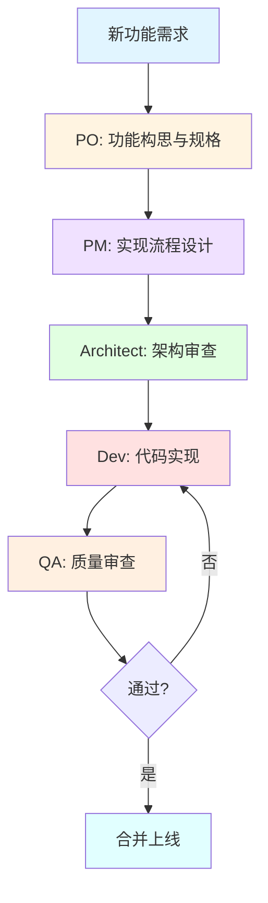

# DailyUse 项目 BMAD 开发流程完整指南

> **版本**: 1.0  
> **日期**: 2025-10-21  
> **适用项目**: DailyUse (MonoRepo + DDD + Contracts-First)

---

## 📋 目录

1. [概述](#概述)
2. [前置准备](#前置准备)
3. [完整开发流程](#完整开发流程)
4. [各阶段详细说明](#各阶段详细说明)
5. [常用命令速查](#常用命令速查)
6. [最佳实践](#最佳实践)
7. [故障排查](#故障排查)

---

## 概述

### 什么是 BMAD？

**BMAD (BMad-Method)** 是一个基于 AI 的多角色开发框架，通过专业化的 AI agents 来协助软件开发的各个环节。

### DailyUse 项目的 BMAD 配置

本项目已针对 **DDD + Contracts-First** 架构对 BMAD agents 进行了定制化增强：

| Agent         | 角色                 | DailyUse 特化能力                               |
| ------------- | -------------------- | ----------------------------------------------- |
| **po**        | Product Owner        | 功能构思、RICE 评分、Feature Spec（含 Gherkin） |
| **pm**        | Project Manager      | Contracts-First 流程、7 层拆解、任务估算        |
| **architect** | System Architect     | DDD 架构、Aggregate Root 模式、事件驱动         |
| **dev**       | Full-Stack Developer | 8 步实现顺序、DDD 合规、测试标准                |
| **qa**        | Quality Assurance    | DDD 合规检查、Contracts 对齐、测试覆盖          |

---

## 前置准备

### 1. 安装 BMAD-METHOD

```bash
# 全局安装 BMAD CLI（如果尚未安装）
npm install -g @bmad-method/cli

# 或使用已有的 web-bundles（无需安装）
# 直接使用 web-bundles/agents/*.txt 文件
```

### 2. 熟悉 DailyUse 架构约束

**必读文档**：

- `.github/prompts/dailyuse.overview.prompt.md` - 项目概览
- `.github/prompts/dailyuse.architecture.prompt.md` - DDD 架构
- `.github/prompts/product.prompt.md` - 产品规范
- `.github/prompts/program.prompt.md` - 项目流程
- `.github/prompts/fullstack.prompt.md` - 全栈开发

**核心约束**（务必牢记）：

- ✅ **Contracts-First**: 所有开发从 `packages/contracts` 开始
- ✅ **时间字段**: 使用 `number` (timestamp)，禁止 `Date` 对象
- ✅ **7 层顺序**: Contracts → Domain → Application → Infrastructure → API → Client → UI → E2E
- ✅ **Aggregate Root**: 子实体只能通过聚合根方法操作
- ✅ **事件驱动**: 所有状态变更发布领域事件

### 3. 项目环境准备

```bash
# 克隆项目
cd d:\myPrograms\DailyUse

# 安装依赖
pnpm install

# 验证环境
pnpm nx run-many -t lint
pnpm nx run-many -t test
pnpm nx run-many -t typecheck
```

---

## 完整开发流程

### 流程图



### 开发阶段总览

| 阶段            | Agent     | 输入                | 输出                     | 预计时间     |
| --------------- | --------- | ------------------- | ------------------------ | ------------ |
| **1. 功能构思** | PO        | 需求描述、目标模块  | Feature Spec + RICE 评分 | 2-4 小时     |
| **2. 流程设计** | PM        | Feature Spec        | Project Flow 文档        | 4-8 小时     |
| **3. 架构审查** | Architect | Project Flow        | 架构决策、风险评估       | 2-4 小时     |
| **4. 代码实现** | Dev       | Project Flow        | 完整代码 + 测试          | 按 Flow 估算 |
| **5. 质量审查** | QA        | 代码 + Feature Spec | 质量报告、改进建议       | 1-2 小时     |

---

## 各阶段详细说明

### 阶段 1️⃣: 功能构思与规格定义 (PO)

#### 触发条件

- 有新的功能想法
- 需要为现有模块添加 Beyond-CRUD 特性
- 产品迭代规划

#### 使用 Agent

```bash
*agent po
```

#### 工作流程

**Step 1: 功能构思**

```
# 示例对话
你: 为 goal 模块生成功能构思

PO: 基于 goal 模块的现有字段 (keyResults, records, reviews, focusCycles)，
    我为你生成 10-20 个 Beyond-CRUD 功能候选...

    [生成 RICE 评分表]
    | 功能 | Reach | Impact | Confidence | Effort | RICE | 优先级 |
    |------|-------|--------|------------|--------|------|--------|
    | 专注周期追踪 | 9 | 8 | 9 | 1 | 648 | P0 |
    | KR 权重快照 | 7 | 6 | 8 | 0.5 | 672 | P0 |
    | ... | ... | ... | ... | ... | ... | ... |
```

**Step 2: 选择功能并生成 Feature Spec**

```
你: 为前 3 个功能生成 Feature Spec

PO: 正在生成...
    - docs/modules/goal/features/01-focus-cycle-tracking.md
    - docs/modules/goal/features/02-kr-weight-snapshot.md
    - docs/modules/goal/features/03-goal-task-linking.md
```

#### 输出产物

**Feature Spec 结构** (`docs/modules/{module}/features/{number}-{feature-name}.md`):

````markdown
# 功能名称

## 1. 概述与目标

- 背景与痛点
- 目标用户
- 价值主张

## 2. 用户价值与场景

- 核心场景 1
- 核心场景 2
- ...

## 3. 设计要点

- 涉及字段（对齐 contracts）
- 交互设计
- 状态流转

## 4. MVP/MMP 路径

- MVP: 核心功能（1-2周）
- MMP: 完整功能（2-4周）
- Full: 优化增强（4-8周）

## 5. 验收标准（Gherkin）

```gherkin
Feature: ...
  Scenario: ...
    Given ...
    When ...
    Then ...
```
````

## 6. 指标与追踪

- 事件埋点
- 成功指标

````

#### 质量检查

PO 阶段完成后确认：
- [ ] 所有字段名与 `packages/contracts` 对齐
- [ ] 时间字段使用 `number` (timestamp)
- [ ] RICE 评分合理，优先级明确
- [ ] Gherkin 验收标准完整
- [ ] MVP/MMP/Full 版本清晰

---

### 阶段 2️⃣: 实现流程设计 (PM)

#### 触发条件
- Feature Spec 已完成并评审通过
- 准备开始技术实现规划

#### 使用 Agent
```bash
*agent pm
````

#### 工作流程

**Step 1: 批量生成实现流程**

```
# 示例对话
你: 分析 goal 模块的功能需求的实现

PM: 正在读取 docs/modules/goal/features/ 下所有功能文档...

    已识别功能:
    1. focus-cycle-tracking
    2. kr-weight-snapshot
    3. goal-task-linking

    正在为每个功能生成 Project Flow...
```

**Step 2: 审查实现流程**

PM 会生成详细的 Project Flow 文档：

```
✅ 已生成实现流程:
- docs/modules/goal/project-flows/FOCUS_CYCLE_TRACKING_FLOW.md
- docs/modules/goal/project-flows/KR_WEIGHT_SNAPSHOT_FLOW.md
- docs/modules/goal/project-flows/GOAL_TASK_LINKING_FLOW.md
```

#### 输出产物

**Project Flow 结构** (`docs/modules/{module}/project-flows/{FEATURE}_FLOW.md`):

```markdown
# {功能名称} 实现流程

## 概览

- 预估时间: X 人天
- 风险级别: Low/Medium/High
- 前置条件: ...
- 版本: MVP

## 实现层序（Contracts-First）

### Phase 1: Contracts Layer (0.5 天)

**任务清单**:

- [ ] 1.1 定义 `GoalFocusCycleServerDTO` in `packages/contracts/src/goal/goal.dto.ts`
  - 字段: `uuid: string`, `goalUuid: string`, `startTime: number`, `endTime: number`, ...
  - 时间字段使用 `number` 类型（timestamp）
- [ ] 1.2 定义 `GoalFocusCycleClientDTO`
- [ ] 1.3 添加 `GoalFocusCycleStartedEvent` in `packages/contracts/src/goal/goal.event.ts`
- [ ] 1.4 更新 `GoalServerDTO` 添加 `focusCycles?: GoalFocusCycleServerDTO[]`

**验收标准**:

- ✅ 所有 DTO 遵循命名规范
- ✅ 时间字段使用 `number`
- ✅ TypeScript 编译通过

**Checkpoint 1**: Architect 审查 Contracts 合规性

### Phase 2: Domain Layer (1 天)

**任务清单**:

- [ ] 2.1 在 `Goal` 聚合根添加 `createFocusCycle()` 方法
- [ ] 2.2 实现业务规则验证（时长限制、并发检查）
- [ ] 2.3 发布领域事件 `GoalFocusCycleStartedEvent`
- [ ] 2.4 编写单元测试（vitest）

**验收标准**:

- ✅ 业务逻辑在 Domain 层
- ✅ 通过聚合根控制子实体
- ✅ 单元测试覆盖 >80%

**Checkpoint 2**: Architect 审查 DDD 合规性

### Phase 3-7: Application → E2E

（类似结构，按层展开...）

## 风险与缓解

| 风险                       | 缓解措施           | 负责人    | 状态   |
| -------------------------- | ------------------ | --------- | ------ |
| 定时器与 Schedule 模块冲突 | 使用独立内存定时器 | Architect | 已缓解 |

## 测试策略

- Contracts: TypeScript 类型检查
- Domain: 单元测试（vitest）
- Application: 用例测试（mock repos）
- Infrastructure: 集成测试（test DB）
- API: E2E 测试（Playwright）
```

#### 质量检查

PM 阶段完成后确认：

- [ ] 严格遵循 7 层顺序（Contracts → E2E）
- [ ] 每层任务拆解到 < 1 天粒度
- [ ] 时间估算包含 20% buffer
- [ ] Checkpoints 明确定义
- [ ] 风险识别与缓解措施完整
- [ ] 测试策略覆盖所有层

---

### 阶段 3️⃣: 架构审查 (Architect)

#### 触发条件

- Project Flow 完成，需要技术决策
- 涉及跨模块集成或复杂设计
- Checkpoint 阶段（Contracts → Domain 等）

#### 使用 Agent

```bash
*agent architect
```

#### 工作流程

**典型审查点**:

```
你: 审查 Goal 模块专注周期功能的架构设计

Architect: 正在审查...

【架构审查报告】

✅ **合规性检查**:
- Contracts 定义完整，字段类型正确
- Domain 层业务逻辑封装良好
- Aggregate Root 模式使用正确

⚠️ **潜在问题**:
1. 定时器实现可能与 Schedule 模块产生冲突
   - 建议: 使用独立的内存定时器服务
   - 优先级: High

2. `focusCycles` 数组可能增长过快
   - 建议: 考虑归档策略或分页加载
   - 优先级: Medium

✅ **设计建议**:
- 事件命名建议: `GoalFocusCycleStarted` → `Goal.FocusCycle.Started`
- 考虑添加 `FocusCycleStatus` 枚举（draft/active/completed/abandoned）
```

#### 输出产物

- 架构审查报告（可选文档或直接反馈）
- 技术决策记录（ADR）
- 更新后的 Project Flow（如有调整）

#### 质量检查

Architect 阶段确认：

- [ ] DDD 4 层边界清晰
- [ ] Aggregate Root 控制模式正确
- [ ] 事件驱动架构合理
- [ ] 无技术债或已记录缓解方案
- [ ] 跨模块依赖合理

---

### 阶段 4️⃣: 代码实现 (Dev)

#### 触发条件

- Project Flow 经过 Architect 审查通过
- 所有 Checkpoints 前置条件满足

#### 使用 Agent

```bash
*agent dev
```

#### 工作流程

**严格的 8 步实现顺序**:

```
你: 实现 Goal 模块的专注周期追踪功能

Dev: 收到。开始实现，严格遵循 Contracts-First 顺序...

【Phase 1: Contracts Layer】
✅ 1.1 定义 GoalFocusCycleServerDTO
✅ 1.2 定义 GoalFocusCycleClientDTO
✅ 1.3 添加 GoalFocusCycleStartedEvent
✅ 1.4 更新 GoalServerDTO
✅ TypeScript 编译通过

【Phase 2: Domain Layer】
✅ 2.1 Goal.createFocusCycle() 方法实现
✅ 2.2 业务规则验证（时长 5-120 分钟，无并发周期）
✅ 2.3 发布领域事件
✅ 2.4 单元测试（vitest）- 覆盖率 85%

【Phase 3: Application Layer】
✅ 3.1 CreateFocusCycleService 实现
✅ 3.2 应用服务单元测试（mocked repos）
✅ 3.3 事件处理器（如需要）

【Phase 4: Infrastructure Layer】
✅ 4.1 更新 GoalPrismaRepository.createFocusCycle()
✅ 4.2 集成测试（test database）

【Phase 5: API Layer】
✅ 5.1 POST /api/v1/goals/:goalId/focus-cycles 端点
✅ 5.2 请求验证中间件
✅ 5.3 API E2E 测试

【Phase 6: Client Layer】
✅ 6.1 useGoalFocusCycle composable
✅ 6.2 类型导出

【Phase 7: UI Layer】
✅ 7.1 FocusCycleTimer.vue 组件
✅ 7.2 FocusCycleList.vue 组件
✅ 7.3 组件测试

【Phase 8: E2E Tests】
✅ 8.1 完整用户流程测试（Playwright）
✅ 8.2 边界场景测试

【质量验证】
✅ pnpm nx run-many -t lint - PASS
✅ pnpm nx run-many -t test - PASS (覆盖率 82%)
✅ pnpm nx run-many -t typecheck - PASS
✅ pnpm nx run web:e2e - PASS

【更新 Story 文档】
✅ 所有 Tasks 标记为完成
✅ Dev Agent Record 更新
✅ File List 完整
✅ Change Log 记录

状态: Ready for Review
```

#### 实现要点

**1. Contracts-First（第一原则）**:

```typescript
// ❌ 错误示例 - 跳过 Contracts 直接写 Domain
class Goal {
  startFocusCycle(duration: number) { ... }  // 没有先定义 DTO！
}

// ✅ 正确示例 - 先定义 Contracts
// Step 1: packages/contracts/src/goal/goal.dto.ts
export interface GoalFocusCycleServerDTO {
  uuid: string;
  goalUuid: string;
  startTime: number;  // ✅ number, NOT Date
  endTime: number;
  duration: number;
  status: 'active' | 'completed' | 'abandoned';
}

// Step 2: packages/domain-client/src/goal/aggregates/Goal.ts
import { GoalFocusCycleServerDTO } from '@dailyuse/contracts';

class Goal {
  createFocusCycle(duration: number): string {
    const cycle: GoalFocusCycleServerDTO = {
      uuid: this.generateUUID(),
      goalUuid: this.uuid,
      startTime: Date.now(),  // ✅ timestamp
      endTime: Date.now() + duration * 60 * 1000,
      duration,
      status: 'active'
    };
    // ...
  }
}
```

**2. Aggregate Root 控制**:

```typescript
// ❌ 错误示例 - 直接创建子实体
const keyResult = new KeyResult({ ... });
goalRepository.saveKeyResult(keyResult);

// ✅ 正确示例 - 通过聚合根
const goal = await goalRepository.getGoalByUuid(goalUuid);
const goalDomain = Goal.fromDTO(goal);
const krUuid = goalDomain.createKeyResult({ ... });  // 聚合根方法
await goalRepository.updateGoal(goalUuid, goalDomain.toDTO());
```

**3. 测试金字塔**:

```bash
# 单元测试（最多）
packages/domain-client/src/goal/__tests__/Goal.test.ts
packages/domain-server/src/goal/__tests__/GoalRepository.test.ts

# 集成测试（中等）
apps/api/src/modules/goal/__tests__/integration/focus-cycle.test.ts

# E2E 测试（最少，但关键）
apps/web/e2e/goal/focus-cycle.spec.ts
```

#### 输出产物

- 完整代码实现（7 层全覆盖）
- 单元测试 + 集成测试 + E2E 测试
- 更新后的 Story 文档（Dev Agent Record）
- File List（所有新增/修改文件清单）

#### 质量检查

Dev 阶段完成后确认：

- [ ] 严格遵循 8 步顺序，无跳跃
- [ ] 所有字段与 Contracts 对齐
- [ ] Aggregate Root 模式正确
- [ ] 测试覆盖率 >80%
- [ ] Lint + TypeCheck + Tests 全部通过
- [ ] E2E 测试覆盖核心流程
- [ ] Story DoD Checklist 完成

---

### 阶段 5️⃣: 质量审查 (QA)

#### 触发条件

- Dev 标记 Story 为 "Ready for Review"
- 代码已提交到 feature branch

#### 使用 Agent

```bash
*agent qa
```

#### 工作流程

```
你: 审查 Goal 模块专注周期功能的代码质量

QA: 正在执行质量审查...

【质量审查报告】

✅ **DDD 合规性**:
- Domain 层业务逻辑封装: PASS
- Aggregate Root 控制: PASS
- Repository 模式使用: PASS
- 领域事件发布: PASS

✅ **Contracts 对齐**:
- DTO 字段命名: PASS
- 时间字段类型（number）: PASS
- 无臆造字段: PASS

⚠️ **测试覆盖**:
- 单元测试: 85% ✅
- 集成测试: 60% ⚠️ (建议提升到 70%)
- E2E 测试: 覆盖核心场景 ✅

❌ **代码问题**:
1. `Goal.createFocusCycle()` 缺少并发检查
   - 位置: packages/domain-client/src/goal/aggregates/Goal.ts:245
   - 建议: 添加 `if (this.hasActiveFocusCycle()) throw Error(...)`
   - 优先级: High

2. API 端点缺少频率限制
   - 位置: apps/api/src/modules/goal/interface/controllers/goalFocusCycleController.ts
   - 建议: 添加 rate limiting middleware
   - 优先级: Medium

✅ **质量门禁**:
- Lint: PASS
- TypeCheck: PASS
- Tests: PASS
- E2E: PASS

【总体评分】: 8.5/10
【建议】: 修复 High 优先级问题后可合并
```

#### 输出产物

- 质量审查报告
- Issue 清单（需修复/建议）
- 质量评分

#### 质量检查

QA 阶段确认：

- [ ] 无 High 优先级问题
- [ ] DDD 合规性通过
- [ ] Contracts 对齐验证通过
- [ ] 测试覆盖率达标
- [ ] 所有质量门禁通过

---

## 常用命令速查

### Agent 切换

```bash
# 查看所有可用 agents
*help

# 切换到指定 agent
*agent po         # Product Owner
*agent pm         # Project Manager
*agent architect  # System Architect
*agent dev        # Developer
*agent qa         # Quality Assurance

# 返回 Orchestrator
*exit
```

### PO (Product Owner) 命令

```bash
# 生成功能构思
为 {模块} 生成功能构思

# 创建 Feature Spec
Create feature spec for {功能名}

# RICE 评分
Prioritize {模块} features with RICE

# 查看可用命令
*help
```

### PM (Project Manager) 命令

```bash
# 批量生成实现流程
分析 {模块} 模块的功能需求的实现

# 单个功能流程
为 {模块} 的 {功能} 生成实现流程

# 创建 PRD
*create-prd

# 查看可用命令
*help
```

### Architect 命令

```bash
# 架构审查
审查 {模块} {功能} 的架构设计

# 创建架构文档
*create-backend-architecture
*create-full-stack-architecture

# 执行架构检查清单
*execute-checklist architect-checklist

# 查看可用命令
*help
```

### Dev (Developer) 命令

```bash
# 实现功能
实现 {模块} 的 {功能} 功能

# 开发 Story
*develop-story

# 运行测试
*run-tests

# 查看可用命令
*help
```

### QA 命令

```bash
# 代码审查
审查 {模块} {功能} 的代码质量

# 检查 DDD 合规性
Check DDD compliance for {模块}

# 执行质量检查清单
*execute-checklist story-dod-checklist

# 查看可用命令
*help
```

### 项目命令

```bash
# Lint
pnpm nx run-many -t lint

# 测试
pnpm nx run-many -t test

# 类型检查
pnpm nx run-many -t typecheck

# E2E 测试
pnpm nx run web:e2e

# 构建
pnpm nx run-many -t build

# 查看依赖图
pnpm nx graph
```

---

## 最佳实践

### 1. Contracts-First 原则

**永远从 Contracts 开始**:

```bash
# ✅ 正确流程
1. 定义 packages/contracts/src/{module}/{module}.dto.ts
2. 定义 packages/contracts/src/{module}/{module}.event.ts
3. 开始实现 Domain 层
4. ...

# ❌ 错误流程
1. 直接写 Domain 实体
2. 后来再补 Contracts（导致不一致）
```

### 2. 时间字段规范

```typescript
// ❌ 错误
interface TaskDTO {
  createdAt: Date; // 禁止使用 Date
  dueDate: Date;
}

// ✅ 正确
interface TaskServerDTO {
  createdAt: number; // timestamp in milliseconds
  dueDate: number;
}

// 使用示例
const task: TaskServerDTO = {
  createdAt: Date.now(),
  dueDate: Date.now() + 24 * 60 * 60 * 1000, // 1 day later
};
```

### 3. Aggregate Root 控制

```typescript
// ❌ 错误 - 直接操作子实体
class Goal {
  keyResults: KeyResult[];
}

// 在其他地方
goal.keyResults.push(new KeyResult(...));  // 绕过业务规则！

// ✅ 正确 - 通过聚合根方法
class Goal {
  private keyResults: KeyResult[];

  createKeyResult(data: CreateKeyResultData): string {
    // 业务规则验证
    if (this.getTotalWeight() + data.weight > 100) {
      throw new Error('权重总和不能超过 100%');
    }

    const kr = new KeyResult({ ...data, goalUuid: this.uuid });
    this.keyResults.push(kr);
    this.publishEvent('KeyResultCreated', kr);
    return kr.uuid;
  }
}
```

### 4. 测试策略

```typescript
// 测试金字塔分布
Unit Tests (70%)       ████████████████████
Integration (20%)      ██████
E2E (10%)              ███

// 示例
// 1. 单元测试 - packages/domain-client/src/goal/__tests__/Goal.test.ts
describe('Goal.createKeyResult', () => {
  it('should validate weight limit', () => {
    const goal = new Goal({ keyResults: [{ weight: 60 }, { weight: 30 }] });
    expect(() => goal.createKeyResult({ weight: 20 })).toThrow('权重总和不能超过 100%');
  });
});

// 2. 集成测试 - apps/api/src/modules/goal/__tests__/integration/keyResult.test.ts
describe('POST /api/v1/goals/:goalId/key-results', () => {
  it('should create key result and persist to DB', async () => {
    const response = await request(app).post(`/api/v1/goals/${goalId}/key-results`).send({...});
    expect(response.status).toBe(201);

    const dbRecord = await prisma.keyResult.findUnique({ where: { uuid: response.body.uuid } });
    expect(dbRecord).toBeTruthy();
  });
});

// 3. E2E 测试 - apps/web/e2e/goal/keyResult.spec.ts
test('user can add key result to goal', async ({ page }) => {
  await page.goto('/goals/123');
  await page.click('[data-testid="add-key-result"]');
  await page.fill('[data-testid="kr-name"]', 'Increase revenue by 20%');
  await page.fill('[data-testid="kr-weight"]', '40');
  await page.click('[data-testid="submit"]');

  await expect(page.locator('[data-testid="kr-list"]')).toContainText('Increase revenue by 20%');
});
```

### 5. 版本迭代策略

```markdown
## MVP (1-2 周)

- 核心流程 happy path
- 基础 UI（无美化）
- 最少验收标准

示例: Goal 专注周期
✅ 开始专注周期（25 分钟固定）
✅ 倒计时显示
✅ 完成记录
❌ 自定义时长
❌ 暂停/取消
❌ 通知提醒

## MMP (2-4 周)

- MVP + 边界场景
- 完整 UI + 交互
- 完整验收标准

示例: Goal 专注周期
✅ MVP 所有功能
✅ 自定义时长（5-120 分钟）
✅ 暂停/恢复/取消
✅ 桌面通知
✅ 历史记录查看
❌ 统计分析
❌ 番茄钟模式

## Full Release (4-8 周)

- MMP + 高级特性
- 性能优化
- 数据分析

示例: Goal 专注周期
✅ MMP 所有功能
✅ 专注时长统计
✅ 效率分析图表
✅ 番茄钟模式
✅ 白噪音/背景音
```

---

## 故障排查

### 问题 1: Agent 不理解 DailyUse 约束

**症状**:

- Agent 建议使用 `Date` 类型
- Agent 建议跳过 Contracts 层
- Agent 不了解 Aggregate Root 模式

**解决方案**:

```bash
# 1. 确认 agent 已加载 customization
*agent po
你: 显示你的 customization 内容

# 2. 明确提醒约束
你: 注意！DailyUse 项目要求：
   - 时间字段必须使用 number (timestamp)
   - 必须从 Contracts 层开始
   - Goal 是聚合根，控制 KeyResult

# 3. 参考文档
你: 请先阅读 .github/prompts/dailyuse.architecture.prompt.md
```

### 问题 2: TypeScript 编译错误

**症状**:

```
error TS2322: Type 'Date' is not assignable to type 'number'
```

**解决方案**:

```typescript
// ❌ 错误代码
const task: TaskServerDTO = {
  createdAt: new Date(), // Type 'Date' is not assignable to type 'number'
};

// ✅ 修复
const task: TaskServerDTO = {
  createdAt: Date.now(), // number (timestamp)
};
```

### 问题 3: 测试失败

**症状**:

```bash
pnpm nx run-many -t test
❌ Goal.createKeyResult should validate weight limit - FAILED
```

**排查步骤**:

```bash
# 1. 查看具体错误
pnpm nx run domain-client:test -- --reporter=verbose

# 2. 运行单个测试
pnpm nx run domain-client:test -- -t "createKeyResult"

# 3. 调试模式
pnpm nx run domain-client:test -- --inspect-brk

# 4. 查看覆盖率
pnpm nx run domain-client:test -- --coverage
```

### 问题 4: E2E 测试失败

**症状**:

```bash
pnpm nx run web:e2e
❌ Timeout 30000ms exceeded
```

**排查步骤**:

```bash
# 1. 启动开发服务器
pnpm nx run web:serve

# 2. 单独运行 E2E
pnpm nx run web:e2e -- --debug

# 3. 查看测试报告
pnpm nx run web:e2e -- --reporter=html

# 4. 检查测试数据库
pnpm prisma studio --schema apps/api/prisma/schema.prisma
```

### 问题 5: Agent 响应速度慢

**原因**: Agent bundle 包含大量资源

**优化方案**:

```bash
# 1. 使用 YOLO 模式跳过确认
*yolo

# 2. 使用特定 agent 而非 orchestrator
*agent dev  # 直接切换，而非通过 orchestrator

# 3. 避免重复加载
# 在同一会话中，agent 状态会保持，无需重新加载
```

---

## 附录

### A. 文档目录结构

```
d:\myPrograms\DailyUse/
├── .github/prompts/           # BMAD 参考文档
│   ├── dailyuse.overview.prompt.md
│   ├── dailyuse.architecture.prompt.md
│   ├── dailyuse.development.prompt.md
│   ├── product.prompt.md
│   ├── program.prompt.md
│   └── fullstack.prompt.md
├── docs/
│   ├── modules/               # 模块文档
│   │   ├── goal/
│   │   │   ├── features/      # PO 产出
│   │   │   │   ├── README.md
│   │   │   │   ├── 01-focus-cycle-tracking.md
│   │   │   │   └── 02-kr-weight-snapshot.md
│   │   │   └── project-flows/ # PM 产出
│   │   │       ├── FOCUS_CYCLE_TRACKING_FLOW.md
│   │   │       └── KR_WEIGHT_SNAPSHOT_FLOW.md
│   │   ├── task/
│   │   ├── reminder/
│   │   └── ...
│   └── architecture/          # Architect 产出
│       ├── decisions/
│       └── diagrams/
├── web-bundles/               # BMAD agents
│   ├── agents/
│   │   ├── po.txt             # ✅ 已增强
│   │   ├── pm.txt             # ✅ 已增强
│   │   ├── architect.txt      # ✅ 已增强
│   │   ├── dev.txt            # ✅ 已增强
│   │   └── qa.txt             # ✅ 已增强
│   └── teams/
│       └── team-fullstack.txt
└── packages/
    └── contracts/             # 起点！
        └── src/
            ├── goal/
            │   ├── goal.dto.ts
            │   ├── goal.event.ts
            │   └── goal.types.ts
            └── ...
```

### B. 关键文件速查

| 文件路径                                                         | 用途            | 负责 Agent       |
| ---------------------------------------------------------------- | --------------- | ---------------- |
| `packages/contracts/src/{module}/{module}.dto.ts`                | DTO 定义        | Dev (必须先定义) |
| `packages/contracts/src/{module}/{module}.event.ts`              | 领域事件        | Dev              |
| `packages/domain-client/src/{module}/aggregates/*.ts`            | 聚合根          | Dev              |
| `packages/domain-server/src/{module}/repositories/*.ts`          | 仓储接口        | Dev              |
| `apps/api/src/modules/{module}/application/services/*.ts`        | 应用服务        | Dev              |
| `apps/api/src/modules/{module}/infrastructure/repositories/*.ts` | 仓储实现        | Dev              |
| `apps/api/src/modules/{module}/interface/controllers/*.ts`       | API 控制器      | Dev              |
| `apps/web/src/modules/{module}/composables/*.ts`                 | Vue Composables | Dev              |
| `apps/web/src/modules/{module}/components/*.vue`                 | Vue 组件        | Dev              |
| `apps/web/e2e/{module}/*.spec.ts`                                | E2E 测试        | Dev              |
| `docs/modules/{module}/features/*.md`                            | Feature Spec    | PO               |
| `docs/modules/{module}/project-flows/*.md`                       | Project Flow    | PM               |

### C. Agent 能力矩阵

| Agent         | 功能构思 | 规格文档 | 流程设计 | 架构决策 | 代码实现 | 质量审查 |
| ------------- | -------- | -------- | -------- | -------- | -------- | -------- |
| **po**        | ⭐⭐⭐   | ⭐⭐⭐   | ❌       | ❌       | ❌       | ❌       |
| **pm**        | ⭐       | ⭐       | ⭐⭐⭐   | ⭐       | ❌       | ❌       |
| **architect** | ❌       | ⭐       | ⭐⭐     | ⭐⭐⭐   | ⭐       | ⭐⭐     |
| **dev**       | ❌       | ❌       | ⭐       | ⭐       | ⭐⭐⭐   | ⭐       |
| **qa**        | ❌       | ❌       | ❌       | ⭐       | ⭐       | ⭐⭐⭐   |

⭐⭐⭐ = 核心能力 | ⭐⭐ = 辅助能力 | ⭐ = 可参与 | ❌ = 不涉及

---

## 总结

通过 BMAD-METHOD 框架，DailyUse 项目实现了：

1. **角色专业化**: 每个 AI Agent 专注于其擅长的领域
2. **流程标准化**: PO → PM → Architect → Dev → QA 的标准化流程
3. **质量保障**: 多重 Checkpoints 和质量门禁
4. **架构一致性**: 强制 Contracts-First + DDD 合规
5. **文档驱动**: 完整的文档体系支撑开发决策

**核心原则**（务必牢记）:

- ✅ Contracts-First（永远第一步）
- ✅ 时间字段 = `number` (timestamp)
- ✅ 7 层顺序不可跳跃
- ✅ Aggregate Root 控制模式
- ✅ 事件驱动架构

祝开发顺利！🚀

---

**文档维护**:

- 作者: GitHub Copilot
- 最后更新: 2025-10-21
- 版本: 1.0
- 反馈: 如有问题或建议，请更新此文档
