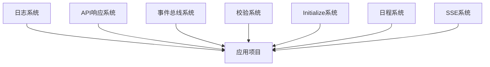

# DailyUse 项目文档中心

> **欢迎来到 DailyUse 项目的文档中心**  
> 这里是了解整个项目架构、系统设计、代码规范的入口

---

## 📚 文档导航

### 🌟 核心文档（必读）

| 文档 | 描述 | 重要性 |
|------|------|--------|
| [[Goal模块完整流程\|Goal模块完整流程]] | Goal 模块从前端到后端的完整实现，展示代码规范和最佳实践 | ⭐⭐⭐⭐⭐ |
| [[日志系统\|日志系统]] | 跨平台日志系统，统一的日志接口和格式 | ⭐⭐⭐⭐⭐ |
| [[API响应系统\|API响应系统]] | 统一的 RESTful API 响应格式 | ⭐⭐⭐⭐⭐ |
| [[事件总线系统\|事件总线系统]] | 基于 mitt 的跨模块事件通信 | ⭐⭐⭐⭐ |
| [[校验系统\|校验系统]] | 框架无关的前端表单校验解决方案 | ⭐⭐⭐⭐ |
| [[Initialize系统\|Initialize系统]] | 统一的应用初始化流程管理 | ⭐⭐⭐ |

---

## 📝 文档规范

### 文档分类和位置

| 分类 | 位置 | 说明 |
|------|------|------|
| 系统文档 | `docs/systems/` | 跨模块的基础设施（日志、API响应、事件总线等） |
| 模块文档 | `docs/modules/` | 具体业务模块的完整实现 |
| 测试文档 | `docs/testing/` | 测试框架、测试指南、测试报告 |
| 开发指南 | `docs/guides/` | 开发流程、技术指南、最佳实践 |
| 示例文档 | `docs/*.md` | API 示例、日志示例等快速参考 |

---

## 🏗️ 项目架构

### 整体架构

DailyUse 采用 **Monorepo + DDD + Contract First** 架构：

```
DailyUse/
├── apps/                    # 应用项目
│   ├── api/                 # 后端 API (Node.js + Express)
│   ├── web/                 # Web 前端 (Vue 3)
│   └── desktop/             # 桌面应用 (Electron)
│
├── packages/                # 共享库
│   ├── contracts/           # 类型定义（前后端共享）
│   ├── domain-core/         # 领域层抽象
│   ├── domain-server/       # 领域层服务端实现
│   ├── domain-client/       # 领域层客户端实现
│   ├── ui/                  # 共享 UI 组件
│   └── utils/               # 工具库
│
└── docs/                    # 文档
    ├── systems/             # 系统文档
    └── modules/             # 模块文档
```

### 技术栈

| 项目 | 技术栈 |
|------|--------|
| **API** | Node.js, Express, Prisma, TypeScript, PostgreSQL |
| **Web** | Vue 3, Pinia, Vite, TypeScript, TailwindCSS |
| **Desktop** | Electron, Vue 3, TypeScript |
| **工具** | pnpm, Nx, Vitest, ESLint |

---

## 🎯 系统文档

### 核心系统 (Systems)

> 位于 `docs/systems/` - 跨模块的基础设施和工具



#### 1. [[日志系统|日志系统]]
- **位置**: `packages/utils/src/logger`
- **作用**: 提供跨平台（Node.js + Browser）的统一日志接口
- **特性**: 多级别、彩色输出、文件日志、环境自适应
- **文档**: [[日志系统|完整文档]] | [[LOGGER_INTEGRATION_GUIDE|集成指南]] | [[LOGGER_QUICK_REFERENCE|快速参考]]

#### 2. [[API响应系统|API响应系统]]
- **位置**: `packages/contracts/src/response` + `packages/utils/src/response`
- **作用**: 统一的 RESTful API 响应格式
- **特性**: 类型安全、HTTP 状态码映射、前端自动提取 data
- **文档**: [[API响应系统|完整文档]] | [[API_RESPONSE_SYSTEM_GUIDE|使用指南]]

#### 3. [[事件总线系统|事件总线系统]]
- **位置**: `packages/utils/src/domain`
- **作用**: 跨模块解耦通信
- **特性**: 基于 mitt、类型安全、双向通信、统计监控

#### 4. [[校验系统|校验系统]]
- **位置**: `packages/utils/src/validation`
- **作用**: 前端表单校验
- **特性**: 框架无关、异步校验、条件校验、国际化

#### 5. [[Initialize系统|Initialize系统]]
- **位置**: `packages/utils/src/initializationManager.ts`
- **作用**: 应用初始化流程管理
- **特性**: 依赖管理、生命周期钩子、并行初始化

#### 6. [[systems/SCHEDULE_INTEGRATION_GUIDE|日程系统]]
- **位置**: Schedule 模块
- **作用**: 日程管理和提醒功能
- **文档**: [[systems/SCHEDULE_INTEGRATION_GUIDE|集成指南]] | [[systems/REMINDER_SCHEDULE_INTEGRATION_COMPLETE|提醒集成]]

#### 7. [[systems/SSE_TECHNICAL_DOCUMENTATION|SSE 技术系统]]
- **位置**: API 服务端
- **作用**: Server-Sent Events 实时通信
- **文档**: [[systems/SSE_TECHNICAL_DOCUMENTATION|技术文档]]

---

## 📦 项目文档

### 应用项目

#### [[API项目]]
- **类型**: 后端 API 服务
- **技术**: Node.js + Express + Prisma
- **职责**: 提供 RESTful 接口，处理业务逻辑
- **入口**: `apps/api/src/index.ts`

#### [[Web项目]]
- **类型**: Web 前端应用
- **技术**: Vue 3 + Pinia + Vite
- **职责**: 提供 Web 端用户界面
- **入口**: `apps/web/src/main.ts`

#### [[Desktop项目]]
- **类型**: 桌面应用
- **技术**: Electron + Vue 3
- **职责**: 提供桌面端用户体验
- **入口**: `apps/desktop/src/main/index.ts`

### 共享库

#### [[Contracts库]]
- **位置**: `packages/contracts`
- **作用**: 前后端共享的类型定义（DTO、接口、响应格式）
- **重要性**: ⭐⭐⭐⭐⭐ (Contract First 架构的核心)

#### [[Utils库]]
- **位置**: `packages/utils`
- **作用**: 通用工具函数和系统
- **包含**: 日志系统、校验系统、事件总线、Initialize 系统等

#### [[Domain-Client库]]
- **位置**: `packages/domain-client`
- **作用**: 客户端领域逻辑（状态管理、API 调用封装）

#### [[UI库]]
- **位置**: `packages/ui`
- **作用**: 共享的 Vue 组件库

---

## 🎯 模块文档

> 位于 `docs/modules/` - 具体业务模块的完整实现

### Goal 模块 ⭐⭐⭐⭐⭐

[[Goal模块完整流程|Goal模块完整流程]]

完整展示 Goal 模块的实现：
- 📁 文件树结构（前端 + 后端）
- 🔄 完整数据流（创建、查询、更新）
- 💻 代码示例（从 UI 组件到数据库）
- 🛠️ 使用的工具和系统
- 📝 代码规范

**Goal 模块相关文档**:
- [[Goal模块完整流程|完整实现流程]] ⭐⭐⭐⭐⭐
- [[modules/GOAL_USER_DATA_INITIALIZATION_GUIDE|用户数据初始化指南]]
- [[modules/GOAL_INITIALIZATION_QUICK_REFERENCE|初始化快速参考]]
- `apps/api/src/modules/goal/docs/CORRECT_DDD_ARCHITECTURE.md` - DDD 架构设计

### 其他模块

- **Account 模块**: 用户账户管理
- **Authentication 模块**: 认证和授权
- **Task 模块**: 任务管理
- **Schedule 模块**: 日程管理
- **Reminder 模块**: 提醒功能

---

## 🧪 测试文档

> 位于 `docs/testing/` - 测试框架和测试指南

| 文档 | 描述 | 重要性 |
|------|------|--------|
| [[testing/TESTING_GUIDE\|测试指南]] | 项目测试最佳实践和规范 | ⭐⭐⭐⭐ |
| [[testing/AI_TESTING_GUIDE\|AI 测试指南]] | AI Agent 自动化测试指南 | ⭐⭐⭐ |
| [[testing/VITEST_WORKSPACE_GUIDE\|Vitest 工作区指南]] | Vitest Monorepo 配置 | ⭐⭐⭐⭐ |
| [[testing/VITEST_WORKSPACE_VERIFICATION_REPORT\|Vitest 验证报告]] | 工作区配置验证结果 | ⭐⭐ |
| [[testing/VITEST_WORKSPACE_CONFIGURATION_SUMMARY\|Vitest 配置总结]] | 配置要点总结 | ⭐⭐⭐ |
| [[testing/CHANGELOG_VITEST\|Vitest 变更日志]] | Vitest 相关变更记录 | ⭐⭐ |

---

## 📘 开发指南

> 位于 `docs/guides/` - 开发流程和技术指南

| 文档 | 描述 | 重要性 |
|------|------|--------|
| [[guides/DEV_SOURCE_MODE\|开发源码模式]] | 源码开发模式配置和使用 | ⭐⭐⭐⭐ |
| [[guides/THEME_SYSTEM_README\|主题系统]] | 应用主题系统设计 | ⭐⭐⭐ |
| [[guides/EDITOR_MODULE_COMPLETION\|编辑器模块]] | 富文本编辑器集成 | ⭐⭐⭐ |

---

## 🚀 快速开始

### 新成员入门

1. **了解整体架构** 
   - 阅读本文档的「项目架构」部分
   - 查看项目根目录的 `README.md`

2. **学习核心系统** ⭐
   - [[日志系统|日志系统]] - 学习如何记录日志
   - [[API响应系统|API响应系统]] - 学习统一的响应格式
   - [[事件总线系统|事件总线系统]] - 学习模块间通信

3. **深入模块实现** ⭐⭐⭐
   - [[Goal模块完整流程|Goal模块完整流程]] - 完整的模块实现示例
   - 参考其代码规范和最佳实践

4. **了解测试规范**
   - [[testing/TESTING_GUIDE|测试指南]] - 学习测试最佳实践
   - [[testing/VITEST_WORKSPACE_GUIDE|Vitest 工作区指南]] - 学习如何配置和运行测试

5. **实践开发**
   - 参考 Goal 模块的实现方式
   - 使用日志系统、响应系统等工具
   - 遵循代码规范

### Agent 使用指南

如果你是 AI Agent，需要重构或新增模块：

1. **必读文档**:
   - [[Goal模块完整流程|Goal模块完整流程]] - 了解标准的模块结构
   - [[日志系统|日志系统]] - 使用 `createLogger()`
   - [[API响应系统|API响应系统]] - 使用 `Response.ok()` 等辅助函数

2. **代码规范**:
   - 参考 [[Goal模块完整流程|Goal模块完整流程]] 的「代码规范」部分
   - 使用 TypeScript 类型注解
   - 遵循命名规范

3. **测试规范**:
   - 参考 [[testing/TESTING_GUIDE|测试指南]]
   - 参考 [[testing/AI_TESTING_GUIDE|AI 测试指南]]

4. **重构流程**:
   - 参考 [[GOAL_CONTROLLER_REFACTOR_COMPLETE]]
   - 使用标准 Response 类型
   - 集成日志系统
   - 添加完善的错误处理

---

## 📝 文档规范

### 文档命名

- **系统文档**: `docs/systems/系统名称.md`
- **模块文档**: `docs/modules/模块名称.md` 或 `docs/模块名称完整流程.md`
- **完成总结**: `XXX_COMPLETE.md`
- **指南**: `XXX_GUIDE.md`
- **快速参考**: `XXX_QUICK_REFERENCE.md`

### Obsidian 链接

使用 `[[文档名称]]` 语法创建链接：

```markdown
详见 [[Goal模块完整流程]] 文档。
使用 [[日志系统]] 记录操作日志。
参考 [[API响应系统]] 的响应格式。
```

---

## 🔗 外部资源

- [Nx Monorepo](https://nx.dev/)
- [Vue 3 文档](https://vuejs.org/)
- [Prisma ORM](https://www.prisma.io/)
- [Pinia Store](https://pinia.vuejs.org/)
- [Vitest 测试](https://vitest.dev/)

---

## 📮 联系方式

**维护者**: DailyUse Team  
**最后更新**: 2025-10-03

---

## 📊 文档统计

| 类型 | 数量 | 位置 |
|------|------|------|
| 核心系统文档 | 7 个 | `docs/systems/` |
| 模块完整流程文档 | 1 个 (Goal) | `docs/modules/` |
| 测试文档 | 6 个 | `docs/testing/` |
| 开发指南 | 3 个 | `docs/guides/` |
| 示例和快速参考 | 5+ 个 | `docs/` 根目录 |

**总计**: 20+ 个核心文档（已清理临时重构文档）

---

**最后更新**: 2025-10-03  
**文档清理**: ✅ 已完成 - 移除了 20+ 个临时重构文档
