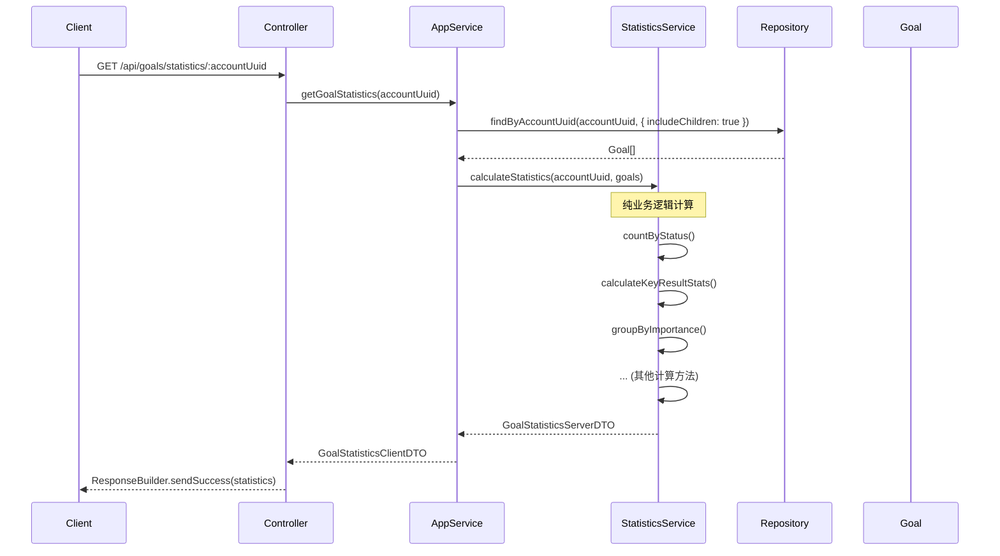

# Goal 模块统计功能实现总结

## 📋 实现概览

本文档记录了 Goal 模块统计功能（GoalStatistics）的实现，遵循 DDD 架构原则。

**实现日期**: 2024-12-XX  
**实现者**: GitHub Copilot  
**关联文档**: `GOAL_MODULE_DDD_REFACTORING_SUMMARY.md`

---

## 🎯 架构决策

### 关键决策：实时计算 vs 持久化统计

与 `RepositoryStatistics` 不同，`GoalStatistics` 采用**实时计算**模式：

| 方案              | RepositoryStatistics | GoalStatistics     |
| ----------------- | -------------------- | ------------------ |
| **持久化**        | ✅ 有独立表          | ❌ 无表            |
| **计算方式**      | 增量更新（事件驱动） | 实时计算           |
| **DomainService** | 注入 Repository      | 纯业务逻辑         |
| **适用场景**      | 大量数据，性能优化   | 数据量小，即时统计 |

**选择理由**：

1. Goal 数据量相对较小（每个账户通常不会超过数百个目标）
2. 统计需求不频繁（用户查看统计的频率低）
3. 实时计算保证数据一致性（无需担心统计与实际数据不同步）
4. 符合刚完成的 DDD 重构原则（DomainService 不注入 Repository）

---

## 📁 文件结构

```
packages/domain-server/src/goal/services/
└── GoalStatisticsDomainService.ts         # 统计计算领域服务（新建）

apps/api/src/modules/goal/application/services/
└── GoalApplicationService.ts              # 更新 getGoalStatistics() 方法
```

---

## 🔧 实现细节

### 1. GoalStatisticsDomainService（纯业务逻辑）

**文件**: `packages/domain-server/src/goal/services/GoalStatisticsDomainService.ts`

#### 架构原则

```typescript
export class GoalStatisticsDomainService {
  /**
   * 构造函数 - 无依赖注入
   */
  constructor() {}

  /**
   * 计算目标统计
   *
   * @param accountUuid - 账户 UUID
   * @param goals - 目标数组（由 ApplicationService 查询）
   * @returns 统计 DTO
   */
  calculateStatistics(accountUuid: string, goals: Goal[]): GoalStatisticsServerDTO;
}
```

**关键特征**：

- ✅ **无依赖注入** - 构造函数为空
- ✅ **同步方法** - 纯计算逻辑，无 async/await
- ✅ **接受聚合数组** - 参数是 `Goal[]`，不是 UUID
- ✅ **返回 DTO** - 直接返回统计 DTO

#### 实现的统计指标

| 指标分类       | 具体指标                                                                                     | 计算逻辑                             |
| -------------- | -------------------------------------------------------------------------------------------- | ------------------------------------ |
| **基础统计**   | totalGoals, activeGoals, completedGoals, archivedGoals                                       | 按状态统计                           |
| **时间统计**   | overdueGoals                                                                                 | 状态=ACTIVE && targetDate < now      |
| **关键结果**   | totalKeyResults, completedKeyResults                                                         | 遍历所有 KeyResult                   |
| **进度统计**   | averageProgress                                                                              | 计算 ACTIVE/COMPLETED 目标的平均进度 |
| **分组统计**   | goalsByImportance, goalsByUrgency, goalsByCategory, goalsByStatus                            | Map/Reduce 分组计数                  |
| **时间段统计** | goalsCreatedThisWeek, goalsCompletedThisWeek, goalsCreatedThisMonth, goalsCompletedThisMonth | 时间范围过滤                         |
| **回顾统计**   | totalReviews, averageRating                                                                  | 统计所有 GoalReview                  |

#### 核心方法列表

```typescript
// 公共方法
calculateStatistics(accountUuid: string, goals: Goal[]): GoalStatisticsServerDTO

// 私有辅助方法（18个）
- countByStatus(goals: Goal[], status: GoalStatus): number
- countOverdueGoals(goals: Goal[]): number
- calculateKeyResultStats(goals: Goal[]): { totalKeyResults, completedKeyResults }
- calculateAverageProgress(goals: Goal[]): number
- groupByImportance(goals: Goal[]): Record<string, number>
- groupByUrgency(goals: Goal[]): Record<string, number>
- groupByCategory(goals: Goal[]): Record<string, number>
- groupByStatus(goals: Goal[]): Record<string, number>
- countCreatedInPeriod(goals: Goal[], period: 'week' | 'month'): number
- countCompletedInPeriod(goals: Goal[], period: 'week' | 'month'): number
- getPeriodStart(now: number, period: 'week' | 'month'): number
- calculateReviewStats(goals: Goal[]): { totalReviews, averageRating }
```

#### 时间计算逻辑

**本周起始时间**（周一 00:00:00）：

```typescript
private getPeriodStart(now: number, period: 'week'): number {
  const date = new Date(now);
  const dayOfWeek = date.getDay() || 7; // 周日=7
  date.setDate(date.getDate() - dayOfWeek + 1);
  date.setHours(0, 0, 0, 0);
  return date.getTime();
}
```

**本月起始时间**（1号 00:00:00）：

```typescript
private getPeriodStart(now: number, period: 'month'): number {
  const date = new Date(now);
  date.setDate(1);
  date.setHours(0, 0, 0, 0);
  return date.getTime();
}
```

---

### 2. GoalApplicationService 更新

**文件**: `apps/api/src/modules/goal/application/services/GoalApplicationService.ts`

#### 添加依赖

```typescript
import { GoalDomainService, GoalStatisticsDomainService, Goal } from '@dailyuse/domain-server';

export class GoalApplicationService {
  private static instance: GoalApplicationService;
  private domainService: GoalDomainService;
  private statisticsDomainService: GoalStatisticsDomainService; // 新增
  private goalRepository: IGoalRepository;

  private constructor(goalRepository: IGoalRepository) {
    this.domainService = new GoalDomainService();
    this.statisticsDomainService = new GoalStatisticsDomainService(); // 新增
    this.goalRepository = goalRepository;
  }
}
```

#### 实现 getGoalStatistics()

```typescript
/**
 * 获取目标统计
 *
 * 架构说明：
 * 1. Query: ApplicationService 查询所有目标
 * 2. Domain: 传递给 StatisticsDomainService 计算统计
 * 3. Return: 返回统计 DTO（无需持久化）
 */
async getGoalStatistics(accountUuid: string): Promise<GoalContracts.GoalStatisticsClientDTO> {
  // 1. 查询账户的所有目标（包括归档，用于完整统计）
  const goals = await this.goalRepository.findByAccountUuid(accountUuid, {
    includeChildren: true, // 包含子目标
  });

  // 2. 委托给 StatisticsDomainService 计算
  const statistics = this.statisticsDomainService.calculateStatistics(accountUuid, goals);

  // 3. 返回 DTO（ServerDTO 和 ClientDTO 结构相同）
  return statistics;
}
```

**架构模式**：

1. **Query**: ApplicationService 查询所有 Goal 聚合
2. **Domain**: 传递聚合数组给 DomainService
3. **Return**: 返回计算结果（无需持久化）

---

## 📦 模块导出更新

**文件**: `packages/domain-server/src/goal/services/index.ts`

```typescript
export * from './GoalDomainService';
export * from './GoalStatisticsDomainService'; // 新增
```

---

## ✅ 验证清单

- [x] **TypeScript 编译通过** - `pnpm tsc --noEmit` 无错误
- [x] **DDD 原则遵守** - DomainService 不注入 Repository
- [x] **方法签名正确** - 接受 `Goal[]` 而非 `string[]`
- [x] **返回类型正确** - 返回 `GoalStatisticsServerDTO`
- [x] **模块导出完整** - 从 `@dailyuse/domain-server` 可导入
- [x] **应用服务集成** - GoalApplicationService 正确使用 StatisticsDomainService
- [x] **无持久化逻辑** - 统计实时计算，不写入数据库

---

## 🔄 数据流示例

### getGoalStatistics() 数据流



---

## 📊 性能考虑

### 时间复杂度

| 操作         | 复杂度    | 说明                        |
| ------------ | --------- | --------------------------- |
| 查询所有目标 | O(n)      | Repository 查询             |
| 统计计算     | O(n \* m) | n=目标数, m=平均KeyResult数 |
| 分组统计     | O(n)      | Map/Reduce                  |
| 总体         | O(n \* m) | 主要开销在 KeyResult 统计   |

### 优化建议（未来）

如果目标数量增长到影响性能（单个账户 > 1000 个目标）：

1. **引入持久化统计表**
   - 创建 `GoalStatistics` 聚合根
   - 事件驱动增量更新（参考 RepositoryStatistics）
   - 定期全量重算校验一致性

2. **分页统计**
   - 按时间范围统计（最近 30 天、本季度）
   - 缓存常用统计结果（Redis）

3. **数据库聚合查询**
   - 使用 Prisma 的 `groupBy` 和 `aggregate`
   - 在 Repository 层实现统计查询方法

---

## 🔗 关联路由

统计功能通过现有路由提供：

```typescript
// apps/api/src/modules/goal/interface/http/goalRoutes.ts

/**
 * @swagger
 * /api/goals/statistics/{accountUuid}:
 *   get:
 *     tags: [Goal]
 *     summary: 获取用户目标统计
 */
router.get('/statistics/:accountUuid', GoalController.getGoalStatistics);
```

---

## 🆚 与 RepositoryStatistics 的对比

| 特性                  | GoalStatistics    | RepositoryStatistics                 |
| --------------------- | ----------------- | ------------------------------------ |
| **持久化**            | ❌ 无表           | ✅ 有表                              |
| **计算方式**          | 实时计算          | 增量更新                             |
| **更新机制**          | 查询时计算        | 事件驱动                             |
| **DomainService依赖** | 无（纯业务逻辑）  | 注入 IRepositoryStatisticsRepository |
| **数据一致性**        | 100% 准确（实时） | 依赖事件同步                         |
| **性能**              | 查询时开销大      | 查询快，更新时开销大                 |
| **复杂度**            | 低（~300行）      | 高（聚合根+Repository+事件）         |
| **适用场景**          | 数据量小，查询少  | 数据量大，查询频繁                   |

---

## 🎓 DDD 原则遵守情况

### ✅ 正确实践

1. **DomainService 纯业务逻辑**

   ```typescript
   // ✅ 正确：不注入 Repository
   export class GoalStatisticsDomainService {
     constructor() {}
     calculateStatistics(accountUuid: string, goals: Goal[]): GoalStatisticsServerDTO;
   }
   ```

2. **ApplicationService 协调**

   ```typescript
   // ✅ 正确：ApplicationService 查询 + DomainService 计算
   async getGoalStatistics(accountUuid: string): Promise<GoalStatisticsClientDTO> {
     const goals = await this.goalRepository.findByAccountUuid(accountUuid, {});
     const statistics = this.statisticsDomainService.calculateStatistics(accountUuid, goals);
     return statistics;
   }
   ```

3. **聚合作为参数**
   ```typescript
   // ✅ 正确：接受 Goal[] 而非 string[]
   calculateStatistics(accountUuid: string, goals: Goal[])
   ```

### ❌ RepositoryStatistics 的反模式（参考对比）

```typescript
// ❌ 反模式：DomainService 注入 Repository
export class RepositoryStatisticsDomainService {
  constructor(
    private readonly statisticsRepo: IRepositoryStatisticsRepository,
    private readonly repositoryRepo: IRepositoryRepository,
  ) {}

  // ❌ DomainService 直接调用 Repository 持久化
  public async getOrCreateStatistics(accountUuid: string): Promise<RepositoryStatistics> {
    let statistics = await this.statisticsRepo.findByAccountUuid(accountUuid);
    if (!statistics) {
      statistics = RepositoryStatistics.createEmpty(accountUuid);
      await this.statisticsRepo.upsert(statistics);
    }
    return statistics;
  }
}
```

**GoalStatistics 避免了这些问题**，完全遵循我们刚建立的 DDD 原则。

---

## 📚 相关文档

- `GOAL_MODULE_DDD_REFACTORING_SUMMARY.md` - Goal 模块 DDD 重构总结
- `MODULE_REFACTORING_STATUS.md` - 模块重构状态追踪
- `GOAL_MODULE_NEW_PROPERTIES_SUMMARY.md` - Goal 模块新属性文档

---

## 🚀 下一步工作

### 待实现功能

1. **GoalFolder 管理**
   - GoalFolderDomainService
   - GoalFolderApplicationService
   - Controller + Routes

2. **Focus Session 流程**
   - FocusSessionDomainService
   - FocusSessionApplicationService
   - 状态机实现

3. **EventBus 集成**
   - 在 ApplicationService 中发布事件
   - 事件监听器注册

### 可选优化（性能需求时）

- 考虑缓存统计结果（Redis）
- 如果目标数量增长，考虑持久化统计表
- 数据库层聚合查询优化

---

## ✅ 实现总结

### 新增文件

- `packages/domain-server/src/goal/services/GoalStatisticsDomainService.ts` (~320 lines)

### 修改文件

- `apps/api/src/modules/goal/application/services/GoalApplicationService.ts` - 更新 getGoalStatistics()
- `packages/domain-server/src/goal/services/index.ts` - 添加导出

### 代码行数

- 新增：~320 lines
- 修改：~30 lines
- 总计：~350 lines

### 编译验证

```bash
✅ pnpm tsc --noEmit - PASSED
```

**实现状态**: ✅ **完成**  
**测试状态**: ⏳ **待编写单元测试**  
**文档状态**: ✅ **完成**
