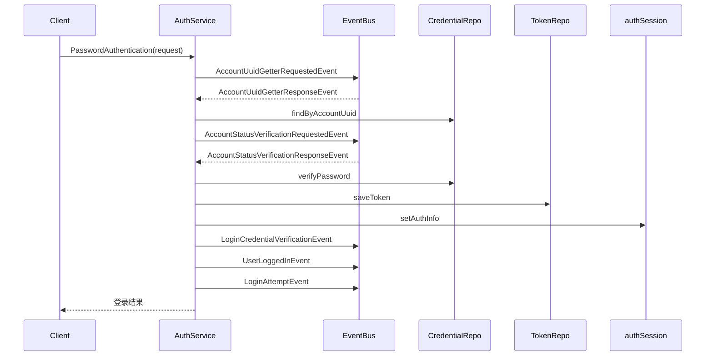

# AuthenticationLoginService 文档

- **文件名称**：electron/modules/Authentication/application/services/authenticationLoginService.ts
- **版本号**：v1.0.0
- **作者**：GitHub Copilot
- **最后更新日期**：2025-08-01

---

## 目录

- [概述](#概述)
- [详细说明](#详细说明)
  - [核心功能模块](#核心功能模块)
  - [主流程说明](#主流程说明)
  - [事件驱动机制](#事件驱动机制)
  - [关键 API 与参数](#关键api与参数)
  - [流程图](#流程图)
- [使用示例](#使用示例)
- [注意事项](#注意事项)
- [附录](#附录)

---

## 概述

`AuthenticationLoginService` 是 Electron 应用中的用户认证服务，负责处理用户登录、凭证校验、账号状态验证、令牌管理及相关事件发布。采用依赖注入和事件驱动架构，支持异步处理，保证认证流程的解耦与可扩展性。适用于需要安全、可审计、易扩展的桌面端认证场景。

**关键特性：**

- 事件驱动异步处理
- 支持依赖注入
- 登录流程全链路事件发布
- 会话与令牌管理
- 超时与异常处理机制

---

## 详细说明

### 核心功能模块

1. **账号 UUID 获取**

   - 通过事件总线异步获取账号唯一标识（UUID），支持超时控制。

2. **认证凭证校验**

   - 查询账号凭证（如密码哈希），并进行密码验证。

3. **账号状态验证**

   - 通过事件驱动异步校验账号状态（如是否允许登录）。

4. **令牌管理**

   - 登录成功后生成并保存访问令牌。

5. **会话管理**

   - 登录后将令牌和账号信息存入会话存储。

6. **事件发布**
   - 登录尝试、凭证验证、用户登录等关键节点均发布事件，便于审计和扩展。

---

### 主流程说明

#### 登录主流程（PasswordAuthentication）

1. 获取账号 UUID（异步事件驱动）
2. 查询认证凭证
3. 验证账号状态（异步事件驱动）
4. 验证登录凭证（密码）
5. 保存令牌
6. 保存登录信息到会话存储
7. 生成会话 ID（使用 `crypto.randomUUID()`）
8. 发布凭证验证事件
9. 发布用户登录事件
10. 发布登录尝试事件
11. 返回登录结果

#### 事件驱动机制

- 所有异步操作（如账号 UUID 获取、账号状态验证）均通过事件总线发布请求和监听响应，Promise 控制超时和结果。
- 事件类型包括：`AccountUuidGetterRequestedEvent`、`AccountStatusVerificationRequestedEvent`、`LoginCredentialVerificationEvent`、`LoginAttemptEvent`、`UserLoggedInEvent` 等。

#### 关键 API 与参数

- `PasswordAuthentication(request: PasswordAuthenticationRequest): Promise<TResponse<PasswordAuthenticationResponse>>`

  - 主入口，处理完整登录流程。
  - 参数：`username`、`password`、`clientInfo`
  - 返回：登录结果（成功/失败、令牌、账号信息）

- `getAccountUuidByUsername(username: string): Promise<{ accountUuid?: string }>`

  - 通过事件驱动获取账号 UUID，10 秒超时。

- `verifyAccountStatus(accountUuid: string, username: string): Promise<AccountStatusVerificationResponseEvent>`

  - 事件驱动校验账号状态，10 秒超时。

- `publishLoginAttemptEvent(payload)`

  - 发布登录尝试事件。

- `publishCredentialVerificationEvent(payload)`

  - 发布凭证验证事件。

- `publishUserLoggedInEvent(payload)`
  - 发布用户登录事件。

#### 流程图



---

## 使用示例

### 1. 登录请求

```typescript
const authService = await AuthenticationLoginService.getInstance();
const response = await authService.PasswordAuthentication({
  username: "testuser",
  password: "password123",
  clientInfo: { ip: "127.0.0.1", device: "PC" },
});
console.log(response);
```

### 2. 获取账号 UUID（内部调用）

```typescript
const { accountUuid } = await authService.getAccountUuidByUsername("testuser");
```

### 3. 事件监听扩展

```typescript
eventBus.subscribe("UserLoggedIn", (event) => {
  // 记录审计日志或触发后续业务
  console.log("用户登录成功:", event.payload);
});
```

---

## 注意事项

- 事件驱动异步操作均有超时机制（默认 10 秒），超时会自动 reject。
- 依赖注入容器需正确配置，否则实例创建可能失败。
- 仅支持 Node.js 16.17+（因使用 `crypto.randomUUID()`）。
- 登录流程所有关键节点均有事件发布，便于扩展和审计。
- 认证凭证校验需保证密码安全存储与验证。

---

## 附录

### 参考资料

- [Node.js crypto 文档](https://nodejs.org/api/crypto.html)
- [uuid npm 包](https://www.npmjs.com/package/uuid)
- [Mermaid 流程图语法](https://mermaid-js.github.io/mermaid/#/sequenceDiagram)

### 术语表

- **事件驱动**：通过事件总线异步发布和监听事件，实现模块解耦。
- **依赖注入**：通过容器动态注入依赖，提升可测试性和扩展性。
- **凭证**：用于认证用户身份的信息，如密码哈希、令牌等。
- **会话**：用户登录后的状态信息，包含令牌和账号标识。

### 版本历史

- v1.0.0 2025-08-01 初版文档

---
