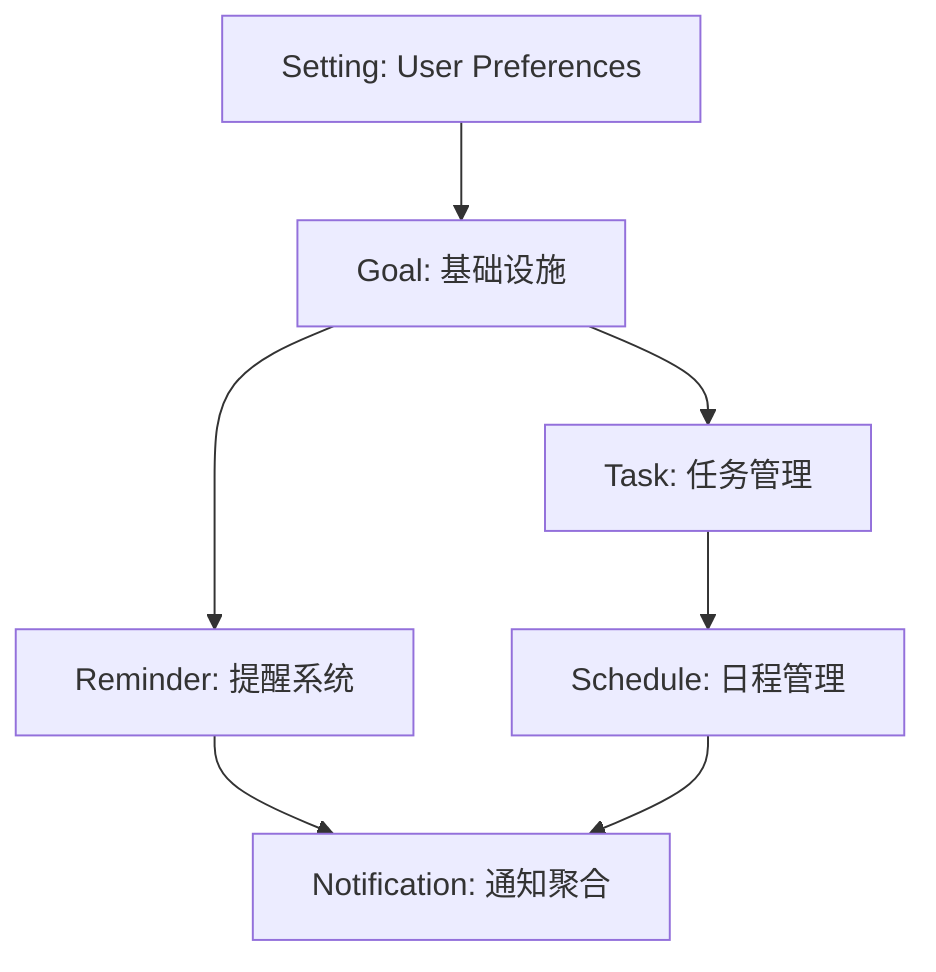

# DailyUse PM 阶段总览

> **阶段**: Project Management (PM)  
> **输入**: 36 个完整 Feature Specs  
> **输出**: Epics, User Stories, Sprint Plans  
> **目标**: 将产品需求转化为可执行的开发任务  
> **日期**: 2025-10-21

---

## 📊 PM 阶段目标

### 主要产出

1. **Epic 文档**: 每个 Feature Spec 对应一个 Epic
2. **User Stories**: 将场景拆解为独立的用户故事
3. **Sprint Plans**: 按优先级和依赖关系组织 Sprints
4. **任务估算**: Story Points + 工时估算
5. **验收标准**: 基于 Feature Spec 的 Gherkin 测试

### 工作范围

本阶段将为 **P0 功能**（MVP 核心）创建完整的项目管理文档：

| 优先级 | 功能数量 | 预估 Story 数 | 目标 Sprint |
| ------ | -------- | ------------- | ----------- |
| **P0** | 10 个    | 40-50 个      | Sprint 1-3  |
| P1     | 10 个    | 待定          | Sprint 4-6  |
| P2     | 9 个     | 待定          | Sprint 7+   |
| P3     | 7 个     | 待定          | 待定        |

---

## 🎯 P0 功能清单

### Goal 模块 (3 个)

| Epic ID       | 功能名称          | RICE | 预估 Stories | 技术复杂度 |
| ------------- | ----------------- | ---- | ------------ | ---------- |
| EPIC-GOAL-002 | KR 权重与进度快照 | 672  | 5            | 中         |
| EPIC-GOAL-003 | 专注周期聚焦模式  | 432  | 4            | 低         |
| EPIC-GOAL-004 | 目标进度自动计算  | 480  | 5            | 中         |

**总计**: 14 Stories, 预估 3-4 周

### Task 模块 (3 个)

| Epic ID       | 功能名称       | RICE | 预估 Stories | 技术复杂度 |
| ------------- | -------------- | ---- | ------------ | ---------- |
| EPIC-TASK-001 | 任务依赖图     | -    | 6            | 高         |
| EPIC-TASK-002 | 任务优先级矩阵 | -    | 5            | 中         |
| EPIC-TASK-006 | 任务依赖关系   | -    | 5            | 高         |

**总计**: 16 Stories, 预估 4-5 周

### Reminder 模块 (1 个)

| Epic ID           | 功能名称     | RICE | 预估 Stories | 技术复杂度 |
| ----------------- | ------------ | ---- | ------------ | ---------- |
| EPIC-REMINDER-001 | 智能提醒频率 | -    | 5            | 中         |

**总计**: 5 Stories, 预估 1-2 周

### Schedule 模块 (1 个)

| Epic ID           | 功能名称     | RICE | 预估 Stories | 技术复杂度 |
| ----------------- | ------------ | ---- | ------------ | ---------- |
| EPIC-SCHEDULE-001 | 日程冲突检测 | -    | 6            | 高         |

**总计**: 6 Stories, 预估 2-3 周

### Notification 模块 (1 个)

| Epic ID               | 功能名称       | RICE | 预估 Stories | 技术复杂度 |
| --------------------- | -------------- | ---- | ------------ | ---------- |
| EPIC-NOTIFICATION-001 | 多渠道通知聚合 | -    | 5            | 中         |

**总计**: 5 Stories, 预估 1-2 周

### Setting 模块 (1 个)

| Epic ID          | 功能名称     | RICE | 预估 Stories | 技术复杂度 |
| ---------------- | ------------ | ---- | ------------ | ---------- |
| EPIC-SETTING-001 | 用户偏好设置 | -    | 4            | 低         |

**总计**: 4 Stories, 预估 1 周

---

## 📈 P0 阶段总体估算

### 工作量统计

- **总 Epic 数**: 10 个
- **总 Story 数**: 50 个（预估）
- **总 Story Points**: 150-180 SP
- **预估工期**: 12-15 周（3-4 个月）
- **建议团队**: 2-3 名全栈开发 + 1 名 QA

### Sprint 规划建议

#### Sprint 1 (2 weeks) - 基础设施

**目标**: 搭建核心架构，完成基础 CRUD

**包含 Epics**:

- EPIC-SETTING-001: 用户偏好设置 (4 stories)
- EPIC-GOAL-003: 专注周期聚焦模式 (4 stories)

**Story Points**: 25-30 SP

#### Sprint 2 (2 weeks) - Goal 核心功能

**目标**: 完成 Goal 模块核心能力

**包含 Epics**:

- EPIC-GOAL-002: KR 权重与进度快照 (5 stories)
- EPIC-GOAL-004: 目标进度自动计算 (5 stories)

**Story Points**: 35-40 SP

#### Sprint 3 (2 weeks) - Task 依赖系统

**目标**: 任务管理核心功能

**包含 Epics**:

- EPIC-TASK-002: 任务优先级矩阵 (5 stories)
- EPIC-TASK-006: 任务依赖关系 (5 stories，部分）

**Story Points**: 30-35 SP

#### Sprint 4 (2 weeks) - Task 可视化

**目标**: 完成任务依赖图

**包含 Epics**:

- EPIC-TASK-001: 任务依赖图 (6 stories)

**Story Points**: 30-35 SP

#### Sprint 5 (2 weeks) - Schedule 与 Reminder

**目标**: 日程管理与提醒系统

**包含 Epics**:

- EPIC-SCHEDULE-001: 日程冲突检测 (6 stories)
- EPIC-REMINDER-001: 智能提醒频率 (部分）

**Story Points**: 30-35 SP

#### Sprint 6 (2 weeks) - Notification 与收尾

**目标**: 通知系统与 MVP 集成

**包含 Epics**:

- EPIC-REMINDER-001: 智能提醒频率 (剩余）
- EPIC-NOTIFICATION-001: 多渠道通知聚合 (5 stories)

**Story Points**: 25-30 SP

---

## 🏗️ 技术架构依赖

### Contracts-First 流程

每个 Epic 的实现顺序：


### 跨模块依赖



**关键依赖关系**:

1. **Setting** 必须最先完成（提供用户配置）
2. **Goal** 是其他模块的基础（目标关联）
3. **Task** 与 **Schedule** 并行开发
4. **Notification** 最后集成（聚合其他模块事件）

---

## 📋 Story 拆解原则

### User Story 模板

```gherkin
Feature: [功能名称]
  As a [用户角色]
  I want [期望行为]
  So that [业务价值]

Scenario: [场景名称]
  Given [前置条件]
  When [触发动作]
  Then [预期结果]
  And [附加验证]
```

### Story 拆分规则

1. **按层拆分**: Contracts → Domain → Application → API → UI
2. **按场景拆分**: 每个 Feature Spec 场景 = 1-2 个 Story
3. **大小控制**: 每个 Story 不超过 5 SP (3-5 天)
4. **独立性**: Story 可独立测试和交付
5. **INVEST 原则**: Independent, Negotiable, Valuable, Estimable, Small, Testable

### Story Point 估算标准

| SP  | 复杂度   | 工时     | 典型任务                    |
| --- | -------- | -------- | --------------------------- |
| 1   | 极简单   | 2-4h     | 简单 DTO 定义、基础 UI 组件 |
| 2   | 简单     | 4-8h     | CRUD API、简单业务逻辑      |
| 3   | 中等     | 1-1.5 天 | 聚合根方法、复杂查询        |
| 5   | 复杂     | 2-3 天   | 复杂算法、集成多个服务      |
| 8   | 非常复杂 | 3-5 天   | 架构级变更、复杂可视化      |

**注意**: 超过 8 SP 的 Story 需要进一步拆分

---

## ✅ Definition of Done (DoD)

### Story 完成标准

每个 Story 必须满足：

#### 1. 代码质量

- ✅ 通过 ESLint 检查
- ✅ 通过 TypeScript 类型检查
- ✅ 代码覆盖率 ≥ 80%
- ✅ 无 TODO/FIXME 注释

#### 2. 测试标准

- ✅ 单元测试（Domain + Application 层）
- ✅ 集成测试（API 层）
- ✅ E2E 测试（关键用户流程）
- ✅ 所有测试通过

#### 3. 文档要求

- ✅ API 文档更新（OpenAPI/Swagger）
- ✅ README 更新（如有新依赖）
- ✅ 代码注释完整（复杂逻辑）
- ✅ Contracts 定义完整

#### 4. DDD 合规

- ✅ Aggregate Root 封装正确
- ✅ 领域事件正确发布
- ✅ Repository 仅操作聚合根
- ✅ 值对象不可变

#### 5. 交付标准

- ✅ 本地开发环境验证
- ✅ PR Review 通过
- ✅ CI/CD Pipeline 通过
- ✅ 产品验收通过

---

## 🔄 PM 阶段工作流程

### Phase 1: Epic 创建 (1-2 天)

1. 读取 Feature Spec
2. 识别核心场景（4-6 个）
3. 创建 Epic 文档（`docs/epics/epic-[module]-[id].md`）
4. 定义验收标准
5. 估算总体工作量

### Phase 2: Story 拆解 (2-3 天)

1. 将每个场景转换为 1-2 个 Story
2. 按技术层次细化任务
3. 添加 Gherkin 测试用例
4. 估算 Story Points
5. 识别依赖关系

### Phase 3: Sprint 规划 (1 天)

1. 按优先级排序 Stories
2. 按依赖关系调整顺序
3. 分配到 Sprint（每 Sprint 25-35 SP）
4. 创建 Sprint Backlog
5. 定义 Sprint 目标

### Phase 4: 验证与调整 (1 天)

1. 与 Architect 对齐技术方案
2. 与 QA 确认测试策略
3. 与 PO 确认验收标准
4. 调整 Story 优先级
5. 最终确认 Sprint Plan

---

## 📂 文档结构

```
docs/
├── epics/
│   ├── epic-goal-002-kr-weight-snapshot.md
│   ├── epic-goal-003-focus-mode.md
│   ├── epic-goal-004-progress-calculation.md
│   ├── epic-task-001-dependency-graph.md
│   ├── epic-task-002-priority-matrix.md
│   ├── epic-task-006-task-dependencies.md
│   ├── epic-reminder-001-smart-frequency.md
│   ├── epic-schedule-001-conflict-detection.md
│   ├── epic-notification-001-multi-channel.md
│   └── epic-setting-001-user-preferences.md
├── stories/
│   ├── goal/
│   │   ├── story-goal-002-001-kr-weight-contracts.md
│   │   ├── story-goal-002-002-kr-weight-domain.md
│   │   └── ...
│   ├── task/
│   ├── reminder/
│   ├── schedule/
│   ├── notification/
│   └── setting/
└── sprints/
    ├── sprint-01-plan.md
    ├── sprint-02-plan.md
    ├── sprint-03-plan.md
    ├── sprint-04-plan.md
    ├── sprint-05-plan.md
    └── sprint-06-plan.md
```

---

## 🎯 下一步行动

### 立即开始

1. **阅读本文档**: 理解 PM 阶段目标和流程
2. **审查 Feature Specs**: 熟悉 10 个 P0 功能的详细需求
3. **创建 Epic 文档**: 从 EPIC-SETTING-001 开始（最简单）
4. **拆解 Stories**: 将 Epic 场景转换为独立 Story
5. **规划 Sprint 1**: 确定前 2 周的开发任务

### 工具与资源

- **Feature Specs**: `docs/modules/*/features/*.md`
- **架构文档**: `docs/architecture/`
- **BMAD Workflow**: `docs/BMAD_DEVELOPMENT_WORKFLOW.md`
- **Contracts 模板**: `packages/contracts/src/`

---

## 📞 协作与沟通

### 角色职责

| 角色          | PM 阶段职责                        |
| ------------- | ---------------------------------- |
| **PM (你)**   | Epic 创建、Story 拆解、Sprint 规划 |
| **PO**        | 验收标准确认、优先级调整           |
| **Architect** | 技术方案审查、依赖识别             |
| **Dev**       | 工作量估算反馈、技术可行性评估     |
| **QA**        | 测试策略确认、DoD 标准验证         |

### 会议节奏

- **Sprint Planning**: 每 Sprint 开始前 1 天
- **Story Refinement**: 每周 2 次，每次 1-2 小时
- **Epic Review**: 每周 1 次，与 PO/Architect 同步

---

_本文档将随 PM 阶段进展持续更新_

**下一个文档**: [Epic-SETTING-001: 用户偏好设置](./epics/epic-setting-001-user-preferences.md)
