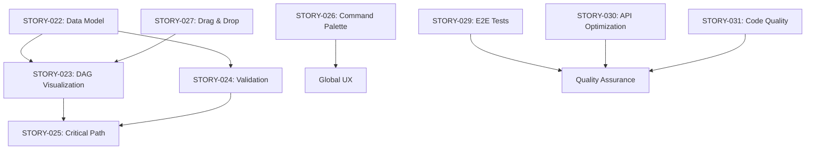

# Sprint 4 Stories Index

**Sprint Duration**: 2024-10-24 ~ 2024-11-07 (2 weeks)  
**Total Story Points**: 24 SP  
**Focus Areas**: Task Dependency System, User Experience Enhancement, Technical Debt

---

## 📊 Sprint Overview

### Sprint 4 Theme: **任务依赖系统与用户体验提升**

基于 Sprint 3 完成的 Goal 系统增强，Sprint 4 将重点完成以下方向：

1. **Task 依赖图可视化** (12 SP) - 核心功能，复用 Goal DAG 技术
2. **用户体验提升** (7 SP) - 基于 Sprint 3 的 UI/UX 优化经验
3. **技术债务清理** (5 SP) - Sprint 3 遗留问题和性能优化

---

## 📋 Stories by Category

### 🔗 Task Dependency System (12 SP)

#### [STORY-022](./STORY-TASK-004-001.md) - Task Dependency Data Model (3 SP) - P0

**User Story**:

> As a user, I want to define dependencies between tasks so that I can manage task execution order.

**Key Features**:

- Define dependency types (finish-to-start, start-to-start, etc.)
- Detect circular dependencies
- Calculate dependency status (blocked, ready, waiting)
- Support dependency CRUD operations

**Technical Scope**:

- Contracts definition (TaskDependency interfaces)
- Domain entities (TaskDependencyEntity)
- Application services (DependencyManagementService)
- Infrastructure layer (TaskDependencyRepository)

---

#### [STORY-023](./STORY-TASK-004-002.md) - Task Dependency DAG Visualization (4 SP) - P0

**User Story**:

> As a user, I want to visualize task dependencies as a DAG so that I can understand task relationships at a glance.

**Key Features**:

- Reuse Goal DAG visualization components
- Show task status and dependency status
- Highlight critical path
- Support zoom, pan, and layout modes
- Export as PNG/SVG/JSON

**Technical Scope**:

- TaskDAGVisualization.vue component
- TaskDependencyService for data transformation
- ECharts integration (reuse from Goal module)
- Layout algorithms (hierarchical, force-directed)

---

#### [STORY-024](./STORY-TASK-004-003.md) - Dependency Validation & Auto-status (3 SP) - P1

**User Story**:

> As a user, I want the system to automatically update task status based on dependencies so that I don't need to manually track blockers.

**Key Features**:

- Detect circular dependencies before save
- Auto-calculate dependency status
- Block task start if dependencies not met
- Notify when dependencies resolved

**Technical Scope**:

- Dependency validation service
- Circular dependency detection algorithm
- Auto-status update rules
- Event system integration

---

#### [STORY-025](./STORY-TASK-004-004.md) - Critical Path Analysis (2 SP) - P1

**User Story**:

> As a project manager, I want to identify the critical path in task dependencies so that I can focus on tasks that affect the overall timeline.

**Key Features**:

- Calculate critical path using topological sort
- Highlight critical tasks in DAG
- Show estimated completion time
- Provide optimization suggestions

**Technical Scope**:

- Critical path calculation algorithm
- TaskCriticalPathService
- UI highlighting for critical tasks
- Timeline estimation based on task duration

---

### 🎨 User Experience Enhancement (7 SP)

#### [STORY-026](./STORY-UX-004-001.md) - Global Search & Command Palette (3 SP) - P0

**User Story**:

> As a user, I want a quick command palette to search and navigate anywhere in the app so that I can improve my workflow efficiency.

**Key Features**:

- Global keyboard shortcut (Cmd/Ctrl + K)
- Fuzzy search across goals, tasks, reminders
- Recent items history
- Quick actions (create, edit, delete)
- Navigation to any page

**Technical Scope**:

- CommandPalette.vue component
- GlobalSearchService with fuzzy matching
- Keyboard shortcut system
- Search indexing for performance

---

#### [STORY-027](./STORY-UX-004-002.md) - Drag & Drop Task Management (2 SP) - P1

**User Story**:

> As a user, I want to drag and drop tasks to reorder or create dependencies so that task management is more intuitive.

**Key Features**:

- Drag task cards to reorder
- Drop task onto another to create dependency
- Visual feedback during drag
- Undo/redo support

**Technical Scope**:

- VueDraggable integration
- Drag & drop event handling
- Dependency auto-creation on drop
- UI/UX animations

---

#### [STORY-028](./STORY-UX-004-003.md) - Dark Mode Support (2 SP) - P2

**User Story**:

> As a user, I want to switch between light and dark themes so that I can use the app comfortably in different environments.

**Key Features**:

- Light/Dark/Auto theme modes
- Persist user preference
- Smooth theme transition
- Update all components and charts

**Technical Scope**:

- Theme system with CSS variables
- Theme switcher component
- LocalStorage persistence
- ECharts theme update

---

### 🔧 Technical Debt & Quality (5 SP)

#### [STORY-029](./STORY-TECH-004-001.md) - E2E Test Coverage Expansion (2 SP) - P1

**User Story**:

> As a developer, I want comprehensive E2E test coverage so that we can catch regressions before production.

**Key Features**:

- Cover all critical user flows
- Playwright test scenarios for Task module
- Add tests for Goal DAG interactions
- CI/CD integration

**Technical Scope**:

- Write 15+ E2E test scenarios
- Add visual regression tests
- Configure parallel test execution
- Generate test reports

---

#### [STORY-030](./STORY-TECH-004-002.md) - API Performance Optimization (1.5 SP) - P2

**User Story**:

> As a developer, I want optimized API response times so that users experience a fast and responsive app.

**Key Features**:

- Implement API response caching
- Add database query optimization
- Reduce N+1 queries
- Add API performance monitoring

**Technical Scope**:

- Redis caching layer
- Query optimization (eager loading)
- Add indexes on frequently queried fields
- Performance monitoring dashboard

---

#### [STORY-031](./STORY-TECH-004-003.md) - Code Quality & Refactoring (1.5 SP) - P2

**User Story**:

> As a developer, I want clean and maintainable code so that future development is easier.

**Key Features**:

- Refactor duplicate code
- Improve type safety
- Add missing documentation
- Update deprecated dependencies

**Technical Scope**:

- Extract common utilities
- Add JSDoc comments
- Fix TypeScript `any` types
- Update to latest package versions

---

## 🎯 Priority Breakdown

| Priority  | Story Points | Stories | Percentage |
| --------- | ------------ | ------- | ---------- |
| P0        | 13 SP        | 4       | 54%        |
| P1        | 8.5 SP       | 4       | 35%        |
| P2        | 2.5 SP       | 3       | 11%        |
| **Total** | **24 SP**    | **11**  | **100%**   |

---

## 📅 Iteration Plan

### Week 1 (P0 Focus - 13 SP)

**Day 1-2**: STORY-022 (Task Dependency Data Model, 3 SP)  
**Day 3-4**: STORY-023 (Task DAG Visualization, 4 SP)  
**Day 5**: STORY-026 (Command Palette, 3 SP)  
**Day 6**: STORY-023 continued + Polish

### Week 2 (P1/P2 Focus - 11 SP)

**Day 7-8**: STORY-024 (Dependency Validation, 3 SP)  
**Day 9**: STORY-025 (Critical Path, 2 SP)  
**Day 10**: STORY-027 (Drag & Drop, 2 SP)  
**Day 11**: STORY-029 (E2E Tests, 2 SP)  
**Day 12**: STORY-028/030/031 (Polish & Optimization)

---

## 🔗 Dependencies

**Key Dependencies**:

- STORY-023, 024, 025 all depend on STORY-022 (data model must be complete first)
- STORY-027 (Drag & Drop) integrates with STORY-023 (DAG visualization)
- STORY-029 (E2E) should cover completed features from STORY-022-028

---

## 📈 Success Metrics

### Technical Metrics

- Task dependency CRUD operations: 100% working
- DAG visualization rendering: <300ms for 50 tasks
- Circular dependency detection: 100% accuracy
- E2E test coverage: ≥80% of critical flows
- API response time: <200ms (95th percentile)

### Functional Metrics

- Users creating task dependencies: ≥40% within 1 week
- Command palette usage: ≥60% of daily active users
- DAG export usage: ≥20% of users with dependencies
- Dark mode adoption: ≥30% of users

### User Satisfaction

- Feature usability score: ≥8/10
- Task dependency feature NPS: ≥7/10
- Performance satisfaction: ≥8/10
- Bug report rate: <3 per week

---

## 💡 Sprint 4 Innovation Points

### 1. **Code Reuse Excellence**

- Leverage Sprint 3's DAG visualization for Task dependencies
- Reuse export, comparison, and animation patterns
- Adapt Goal weight concepts to Task duration/effort

### 2. **Enhanced User Experience**

- Command palette brings modern IDE-like workflow
- Drag & drop makes dependency creation intuitive
- Dark mode improves accessibility

### 3. **Quality First Approach**

- Expand E2E coverage before adding more features
- API optimization ensures scalability
- Code refactoring maintains technical health

---

## 🎓 Lessons from Sprint 3

### ✅ Continue Doing

1. **Modular Service Design**: Keep clear separation of concerns
2. **Performance Monitoring**: Proactive performance testing
3. **Comprehensive Documentation**: Detailed completion reports
4. **Code Reuse**: Leverage existing patterns and components

### ⚠️ Improvements

1. **Test Early**: Address test issues at sprint start (STORY-029)
2. **Smaller Stories**: Break down 4 SP stories if possible
3. **API First**: Complete backend before heavy frontend work

### 🔄 Adjusted Approach

- Defer STORY-012 (Vitest) indefinitely - use current setup
- Focus on delivered features over infrastructure complexity
- Prioritize user-visible improvements

---

## 📝 Notes

### Technical Decisions

- **Skip STORY-012/013**: Continue with current test setup, revisit later
- **Reuse DAG Code**: ~60% code reuse from Goal module saves time
- **Command Palette**: Use existing library (cmdk or Kbar)

### Risk Assessment

- **Medium Risk**: STORY-023 (DAG adaptation might need refactoring)
- **Low Risk**: STORY-026 (well-defined pattern)
- **Low Risk**: STORY-022 (straightforward data modeling)

### Buffer Planning

- 2 SP buffer for unexpected issues (already included in 24 SP)
- Can defer STORY-028/030/031 if needed (all P2)

---

## 🚀 Sprint 4 Goals

**Primary Goal**: Deliver a fully functional Task dependency system with excellent UX

**Stretch Goals**:

- Complete all P0 + P1 stories (21.5 SP)
- Achieve ≥80% E2E test coverage
- Dark mode implementation

**Must-Have**:

- STORY-022: Data model (foundation)
- STORY-023: DAG visualization (user-facing value)
- STORY-026: Command palette (UX improvement)

**Nice-to-Have**:

- STORY-028: Dark mode
- STORY-030/031: Optimizations

---

**Created**: 2024-10-23  
**Sprint Start**: 2024-10-24  
**Sprint End**: 2024-11-07  
**Team Capacity**: 24 SP (based on Sprint 3 velocity: 9.7 SP/day × 2.5 days avg)
