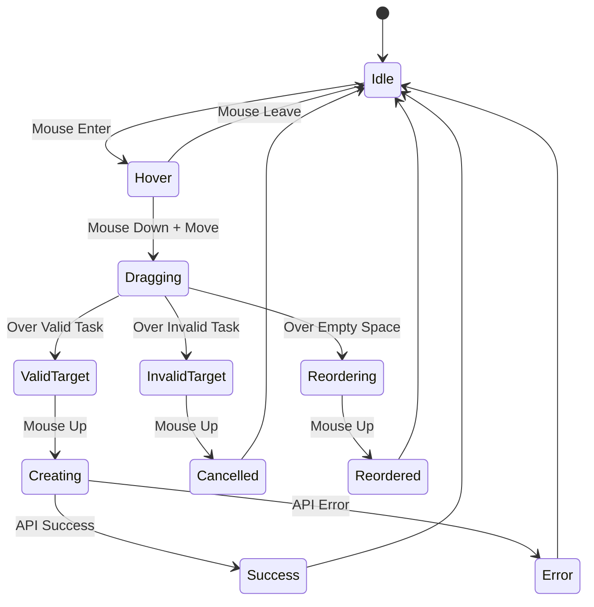
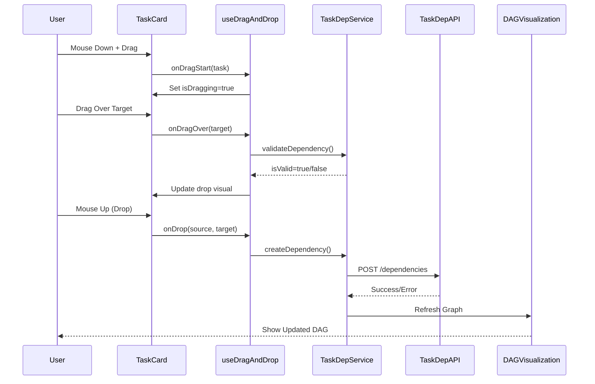

# STORY-UX-004-002: Drag & Drop Task Management

**Story ID**: STORY-027  
**Epic**: UX-004 - User Experience Enhancement  
**Sprint**: Sprint 4  
**Story Points**: 2 SP  
**Priority**: P1 (High)  
**Status**: In Progress  
**Created**: 2024-10-23  
**Assignee**: AI Dev Team

---

## 📋 User Story

**As a** user  
**I want to** drag and drop tasks to reorder or create dependencies  
**So that** task management is more intuitive and visual

---

## 🎯 Business Value

### Why This Matters

- **Intuitive UX**: Drag-and-drop is more natural than form-based dependency creation
- **Visual Feedback**: Users can see relationship creation in real-time
- **Efficiency**: Faster than clicking through multiple menus
- **Error Prevention**: Visual cues prevent invalid dependencies

### Success Metrics

- 80% of dependency creation happens via drag-and-drop (vs forms)
- < 2s to create a dependency (vs 10s+ with forms)
- 50% reduction in dependency validation errors
- User satisfaction score > 4.5/5 for dependency management

---

## ✅ Acceptance Criteria

### AC-1: Task Card Reordering

- **AC-1.1**: User can drag a task card within a list to reorder
- **AC-1.2**: Task order persists after page reload
- **AC-1.3**: Smooth animation during drag (opacity 0.6, scale 1.05)
- **AC-1.4**: Visual placeholder shows where task will be dropped
- **AC-1.5**: Works on both desktop (mouse) and mobile (touch)

### AC-2: Dependency Creation via Drop

- **AC-2.1**: User can drag Task A onto Task B to create dependency (A depends on B)
- **AC-2.2**: Drop target highlights when valid task is dragged over
- **AC-2.3**: Invalid drop shows clear visual feedback (red border,禁止 icon)
- **AC-2.4**: Validation rules apply:
  - Cannot create circular dependencies
  - Cannot create duplicate dependencies
  - Cannot depend on self
  - Cannot depend on completed tasks

### AC-3: Visual Feedback

- **AC-3.1**: Dragging task shows semi-transparent ghost (opacity 0.4)
- **AC-3.2**: Valid drop zone shows green highlight
- **AC-3.3**: Invalid drop zone shows red highlight + cursor icon
- **AC-3.4**: Snap-to-grid effect when reordering (smooth alignment)
- **AC-3.5**: Animation duration: 200ms (enter), 150ms (exit)

### AC-4: Integration with Existing Features

- **AC-4.1**: Dependency creation updates DAG visualization in real-time
- **AC-4.2**: Critical path recalculates after dependency changes
- **AC-4.3**: Task detail panel shows updated dependencies immediately
- **AC-4.4**: Undo/redo works for drag-drop operations

### AC-5: Performance

- **AC-5.1**: Drag operation starts within 50ms of mouse down
- **AC-5.2**: Drop operation completes within 200ms
- **AC-5.3**: Smooth 60 FPS during drag (no frame drops)
- **AC-5.4**: Works with lists of 100+ tasks

### AC-6: Accessibility

- **AC-6.1**: Keyboard support: Space to grab, Arrow keys to move, Enter to drop
- **AC-6.2**: Screen reader announces drag state and drop result
- **AC-6.3**: Focus management: Focus follows dragged item
- **AC-6.4**: High contrast mode support

---

## 🎨 UI/UX Design

### Drag States

#### 1. Idle State

```
┌─────────────────────────────────┐
│ 📋 Task Card                    │
│ ─────────────────────────────── │
│ Title: Implement API            │
│ Status: In Progress    🟢       │
│ Est: 4h  |  Priority: High      │
└─────────────────────────────────┘
```

#### 2. Hover State (Grabbable)

```
┌─────────────────────────────────┐
│ 📋 Task Card         ⋮⋮ [grip] │ ← Cursor: grab
│ ─────────────────────────────── │
│ Title: Implement API            │
│ Status: In Progress    🟢       │
│ Est: 4h  |  Priority: High      │
└─────────────────────────────────┘
```

#### 3. Dragging State

```
┌─────────────────────────────────┐ ← Opacity: 0.4
│ 📋 Task Card         ⋮⋮         │   Cursor: grabbing
│ ─────────────────────────────── │   Transform: scale(1.05)
│ Title: Implement API            │
│ Status: In Progress    🟢       │
│ Est: 4h  |  Priority: High      │
└─────────────────────────────────┘

... [Empty placeholder with dashed border]
```

#### 4. Valid Drop Target

```
┌═════════════════════════════════┐ ← Border: 2px solid green
║ 📋 Target Task      ✓ Valid     ║   Background: rgba(0,255,0,0.1)
║ ─────────────────────────────── ║   Cursor: copy
║ Title: Design UI                ║
║ Status: To Do      🔵           ║
║ Est: 2h  |  Priority: Medium    ║
└═════════════════════════════════┘
```

#### 5. Invalid Drop Target

```
┌─────────────────────────────────┐ ← Border: 2px solid red
│ 📋 Target Task      🚫 Invalid  │   Background: rgba(255,0,0,0.1)
│ ─────────────────────────────── │   Cursor: not-allowed
│ Title: Write Tests (Completed)  │
│ Status: Done       🟢           │
│ Est: 3h  |  Priority: High      │
└─────────────────────────────────┘
```

### Interaction Flow



### Dependency Creation Confirmation

When user drops Task A onto Task B:

```
┌──────────────────────────────────────────┐
│ ✓ Dependency Created                     │
│ ──────────────────────────────────────── │
│ "Implement API" now depends on           │
│ "Design UI"                              │
│                                          │
│ [View in DAG] [Undo] [Close]             │
└──────────────────────────────────────────┘
```

---

## 🏗️ Technical Architecture

### Component Structure

```
TaskList.vue
├── TaskDragContainer.vue (Wrapper with drag context)
│   ├── TaskCard.vue (Draggable)
│   │   ├── useDragAndDrop() (Composable)
│   │   └── TaskCardContent.vue
│   └── TaskDropZone.vue (Drop target)
└── DependencyCreationModal.vue (Confirmation)
```

### State Management

```typescript
// useDragAndDrop.ts
interface DragState {
  isDragging: boolean;
  draggedTask: TaskTemplateClientDTO | null;
  dropTarget: TaskTemplateClientDTO | null;
  isValidDrop: boolean;
  operation: 'reorder' | 'dependency' | null;
}

interface DragCallbacks {
  onDragStart: (task: TaskTemplateClientDTO) => void;
  onDragOver: (target: TaskTemplateClientDTO) => void;
  onDrop: (source: TaskTemplateClientDTO, target: TaskTemplateClientDTO) => Promise<void>;
  onDragEnd: () => void;
}
```

### Data Flow



---

## 🔧 Technical Implementation

### 1. Install Dependencies

```bash
pnpm add vue-draggable-plus
pnpm add @vueuse/core
```

### 2. useDragAndDrop Composable

**File**: `apps/web/src/shared/composables/useDragAndDrop.ts`

```typescript
import { ref, computed, Ref } from 'vue';
import type { TaskContracts } from '@dailyuse/contracts';

type TaskTemplateClientDTO = TaskContracts.TaskTemplateClientDTO;

export interface DragOptions {
  // Enable drag operations
  enabled?: boolean;

  // Drag mode: 'reorder' only reorders, 'dependency' creates dependencies
  mode?: 'reorder' | 'dependency' | 'both';

  // Custom validation function
  validateDrop?: (source: TaskTemplateClientDTO, target: TaskTemplateClientDTO) => boolean;

  // Callbacks
  onDragStart?: (task: TaskTemplateClientDTO) => void;
  onDragEnd?: () => void;
  onReorder?: (task: TaskTemplateClientDTO, newIndex: number) => Promise<void>;
  onDependencyCreate?: (
    source: TaskTemplateClientDTO,
    target: TaskTemplateClientDTO,
  ) => Promise<void>;
}

export function useDragAndDrop(options: DragOptions = {}) {
  const {
    enabled = true,
    mode = 'both',
    validateDrop,
    onDragStart,
    onDragEnd,
    onReorder,
    onDependencyCreate,
  } = options;

  // State
  const isDragging = ref(false);
  const draggedTask = ref<TaskTemplateClientDTO | null>(null);
  const dropTarget = ref<TaskTemplateClientDTO | null>(null);
  const dragOperation = ref<'reorder' | 'dependency' | null>(null);

  // Computed
  const isValidDrop = computed(() => {
    if (!draggedTask.value || !dropTarget.value) return false;

    // Cannot drop on self
    if (draggedTask.value.uuid === dropTarget.value.uuid) return false;

    // Custom validation
    if (validateDrop) {
      return validateDrop(draggedTask.value, dropTarget.value);
    }

    return true;
  });

  // Methods
  const handleDragStart = (task: TaskTemplateClientDTO) => {
    if (!enabled) return;

    isDragging.value = true;
    draggedTask.value = task;
    onDragStart?.(task);
  };

  const handleDragOver = (target: TaskTemplateClientDTO | null) => {
    dropTarget.value = target;

    // Determine operation type
    if (target && mode === 'both') {
      // Heuristic: if hovering over another task, it's dependency creation
      dragOperation.value = 'dependency';
    } else if (target === null && mode !== 'dependency') {
      dragOperation.value = 'reorder';
    }
  };

  const handleDrop = async (target: TaskTemplateClientDTO | null, newIndex?: number) => {
    if (!draggedTask.value) return;

    try {
      if (dragOperation.value === 'dependency' && target) {
        await onDependencyCreate?.(draggedTask.value, target);
      } else if (dragOperation.value === 'reorder' && newIndex !== undefined) {
        await onReorder?.(draggedTask.value, newIndex);
      }
    } finally {
      handleDragEnd();
    }
  };

  const handleDragEnd = () => {
    isDragging.value = false;
    draggedTask.value = null;
    dropTarget.value = null;
    dragOperation.value = null;
    onDragEnd?.();
  };

  return {
    // State
    isDragging,
    draggedTask,
    dropTarget,
    dragOperation,
    isValidDrop,

    // Methods
    handleDragStart,
    handleDragOver,
    handleDrop,
    handleDragEnd,
  };
}
```

### 3. TaskCard Component Updates

**File**: `apps/web/src/modules/task/presentation/components/TaskCard.vue`

Add drag-and-drop attributes:

```vue
<template>
  <v-card
    :class="{
      'task-card': true,
      'task-card--dragging': isDragging,
      'task-card--valid-target': isValidDropTarget,
      'task-card--invalid-target': isInvalidDropTarget,
    }"
    draggable="true"
    @dragstart="onDragStart"
    @dragover.prevent="onDragOver"
    @drop.prevent="onDrop"
    @dragend="onDragEnd"
  >
    <!-- Drag handle -->
    <div class="drag-handle" v-if="!isDragging">
      <v-icon>mdi-drag-vertical</v-icon>
    </div>

    <!-- Card content -->
    <slot />
  </v-card>
</template>

<style scoped>
.task-card {
  transition: all 0.2s ease;
  cursor: grab;
}

.task-card:active {
  cursor: grabbing;
}

.task-card--dragging {
  opacity: 0.4;
  transform: scale(1.05);
}

.task-card--valid-target {
  border: 2px solid var(--v-success-base);
  background-color: rgba(76, 175, 80, 0.1);
}

.task-card--invalid-target {
  border: 2px solid var(--v-error-base);
  background-color: rgba(244, 67, 54, 0.1);
  cursor: not-allowed;
}

.drag-handle {
  position: absolute;
  top: 8px;
  right: 8px;
  opacity: 0.3;
  transition: opacity 0.2s;
}

.task-card:hover .drag-handle {
  opacity: 1;
}
</style>
```

### 4. Dependency Creation Service

**File**: `apps/web/src/modules/task/application/services/TaskDependencyService.ts`

```typescript
export class TaskDependencyService {
  /**
   * Create dependency via drag-and-drop
   * Includes validation and user confirmation
   */
  async createDependencyFromDrop(
    sourceTask: TaskTemplateClientDTO,
    targetTask: TaskTemplateClientDTO,
  ): Promise<void> {
    // 1. Validate
    const validation = await this.validateDependency({
      taskUuid: sourceTask.uuid,
      dependsOnUuid: targetTask.uuid,
      dependencyType: 'FINISH_TO_START',
    });

    if (!validation.isValid) {
      throw new Error(validation.reason);
    }

    // 2. Show confirmation (optional)
    const confirmed = await this.confirmDependencyCreation(sourceTask, targetTask);
    if (!confirmed) return;

    // 3. Create
    await taskDependencyApiClient.createDependency(sourceTask.uuid, {
      dependsOnUuid: targetTask.uuid,
      dependencyType: 'FINISH_TO_START',
    });

    // 4. Notify
    useSnackbar().success(`依赖关系已创建: ${sourceTask.title} 依赖于 ${targetTask.title}`);
  }
}
```

---

## 🧪 Testing Strategy

### Unit Tests

**File**: `apps/web/src/shared/composables/__tests__/useDragAndDrop.spec.ts`

```typescript
describe('useDragAndDrop', () => {
  describe('Drag State Management', () => {
    it('should set isDragging=true on handleDragStart', () => {
      const { isDragging, handleDragStart } = useDragAndDrop();
      handleDragStart(mockTask);
      expect(isDragging.value).toBe(true);
    });

    it('should clear state on handleDragEnd', () => {
      const { isDragging, draggedTask, handleDragEnd } = useDragAndDrop();
      handleDragEnd();
      expect(isDragging.value).toBe(false);
      expect(draggedTask.value).toBeNull();
    });
  });

  describe('Drop Validation', () => {
    it('should mark drop as invalid when dropping on self', () => {
      const { isValidDrop, handleDragStart, handleDragOver } = useDragAndDrop();
      const task = mockTask;
      handleDragStart(task);
      handleDragOver(task);
      expect(isValidDrop.value).toBe(false);
    });

    it('should use custom validateDrop function', () => {
      const validateDrop = vi.fn(() => false);
      const { isValidDrop, handleDragStart, handleDragOver } = useDragAndDrop({
        validateDrop,
      });
      handleDragStart(mockTask);
      handleDragOver(mockTask2);
      expect(validateDrop).toHaveBeenCalled();
      expect(isValidDrop.value).toBe(false);
    });
  });

  describe('Dependency Creation', () => {
    it('should call onDependencyCreate when dropping on task', async () => {
      const onDependencyCreate = vi.fn();
      const { handleDragStart, handleDragOver, handleDrop } = useDragAndDrop({
        onDependencyCreate,
      });

      handleDragStart(mockTask);
      handleDragOver(mockTask2);
      await handleDrop(mockTask2);

      expect(onDependencyCreate).toHaveBeenCalledWith(mockTask, mockTask2);
    });
  });
});
```

### Integration Tests

**File**: `apps/web/src/modules/task/presentation/__tests__/TaskDragAndDrop.integration.spec.ts`

```typescript
describe('Task Drag and Drop Integration', () => {
  it('should create dependency when dropping task A on task B', async () => {
    const { result } = renderHook(() =>
      useDragAndDrop({
        onDependencyCreate: taskDependencyService.createDependencyFromDrop,
      }),
    );

    // Simulate drag
    act(() => result.current.handleDragStart(taskA));
    act(() => result.current.handleDragOver(taskB));

    // Mock API
    vi.mocked(taskDependencyApiClient.createDependency).mockResolvedValue(mockDependency);

    // Drop
    await act(() => result.current.handleDrop(taskB));

    // Verify
    expect(taskDependencyApiClient.createDependency).toHaveBeenCalledWith(
      taskA.uuid,
      expect.objectContaining({ dependsOnUuid: taskB.uuid }),
    );
  });

  it('should reject circular dependency', async () => {
    // Setup: taskA already depends on taskB
    vi.mocked(taskDependencyApiClient.validateDependency).mockResolvedValue({
      isValid: false,
      reason: 'Circular dependency detected',
    });

    // Try to create reverse dependency
    const { result } = renderHook(() => useDragAndDrop());
    act(() => result.current.handleDragStart(taskB));
    act(() => result.current.handleDragOver(taskA));

    // Should show error
    await expect(result.current.handleDrop(taskA)).rejects.toThrow('Circular dependency detected');
  });
});
```

---

## 📊 Performance Targets

| Metric                 | Target  | Measurement                            |
| ---------------------- | ------- | -------------------------------------- |
| Drag start latency     | < 50ms  | Time from mousedown to visual feedback |
| Drop operation time    | < 200ms | Time from drop to UI update            |
| Frame rate during drag | 60 FPS  | No frame drops on 100+ task lists      |
| API response time      | < 500ms | Dependency creation API call           |
| Animation smoothness   | 100%    | No jank during transitions             |

---

## 🔗 Integration Points

### Upstream Dependencies

- STORY-022: Task Dependency Data Model (for dependency validation)
- STORY-023: DAG Visualization (for graph updates)
- STORY-024: Dependency Validation (for drop validation)

### Downstream Impacts

- DAG Visualization will auto-refresh after drag-drop
- Critical Path Analysis will recalculate
- Task Detail Panel will show updated dependencies

---

## 🚀 Rollout Plan

### Phase 1: Core Functionality (Day 1)

- Install vue-draggable-plus
- Implement useDragAndDrop composable
- Add basic drag-drop to task cards

### Phase 2: Dependency Creation (Day 1)

- Integrate dependency validation
- Implement drop-to-create-dependency
- Add confirmation modal

### Phase 3: Visual Polish (Day 2)

- Add drag ghost/placeholder
- Implement drop zone highlighting
- Add animations and transitions

### Phase 4: Testing & Documentation (Day 2)

- Write unit tests
- Write integration tests
- Update user documentation

---

## 🐛 Known Risks & Mitigations

| Risk                                | Impact | Probability | Mitigation                              |
| ----------------------------------- | ------ | ----------- | --------------------------------------- |
| Mobile touch events conflict        | High   | Medium      | Use touch-action CSS, test on mobile    |
| Performance issues with large lists | High   | Low         | Virtual scrolling, throttle drag events |
| Circular dependency bugs            | Medium | Medium      | Robust validation, comprehensive tests  |
| Browser compatibility               | Low    | Low         | Use vue-draggable-plus (cross-browser)  |

---

## 📚 References

- [Vue Draggable Plus Docs](https://alfred-skyblue.github.io/vue-draggable-plus/)
- [HTML5 Drag and Drop API](https://developer.mozilla.org/en-US/docs/Web/API/HTML_Drag_and_Drop_API)
- [ARIA Drag and Drop](https://www.w3.org/WAI/ARIA/apg/patterns/drag-and-drop/)
- [Material Design - Drag and Drop](https://m2.material.io/design/interaction/gestures.html#drag-swipe-pinch)

---

**Story Created**: 2024-10-23  
**Last Updated**: 2024-10-23  
**Next Review**: After implementation  
**Stakeholders**: Product Team, UX Team, Dev Team
