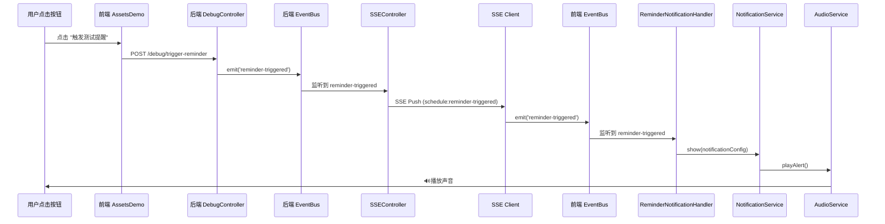

# SSE 通知流程修复总结

## 🎯 问题描述

用户发现 AI 每隔一分钟的定时提醒没有声音，调试后发现测试提醒功能存在问题：
- 测试按钮直接在前端播放声音，绕过了 SSE 事件流
- 没有真正测试 **SSE 推送 → 事件总线 → Notification 模块** 的完整链路
- 导致无法验证 Notification 模块是否正常工作

## 🔍 根本原因

### 原有流程（错误）

```
前端点击按钮 
  → HTTP POST 请求 
  → 后端返回成功 
  → ❌ 前端直接播放声音（audioService.playSuccess()）
```

**问题：**
1. 测试流程不完整，没有经过 SSE 推送
2. 后端虽然 `eventBus.emit('reminder-triggered')`，但这是**后端的事件总线**
3. 前端的 SSE 客户端没有收到任何事件
4. Notification 模块的监听器从未被触发

### 正确流程

```
前端点击按钮
  → HTTP POST 请求
  → 后端接收请求
  → 🔥 后端 eventBus.emit('reminder-triggered')
  → SSEController 监听到事件
  → SSE 推送 'schedule:reminder-triggered' 事件
  → 前端 SSE Client 接收事件
  → 🔥 前端 eventBus.emit('reminder-triggered')
  → ReminderNotificationHandler 监听到事件
  → NotificationService 处理通知
  → AudioNotificationService 播放声音
  → ✅ 听到提醒音效
```

## ✅ 修复内容

### 1. 后端修改

**文件：** `apps/api/src/modules/schedule/interface/http/debugController.ts`

**修改前：**
```typescript
// ❌ 直接使用后端 eventBus，但前端收不到
eventBus.emit('ui:show-popup-reminder', reminderData);
eventBus.emit('ui:play-reminder-sound', {...});
eventBus.emit('system:show-notification', {...});
eventBus.emit('reminder-triggered', reminderData);
```

**修改后：**
```typescript
// ✅ 只触发一个事件，由 SSEController 监听并推送
eventBus.emit('reminder-triggered', reminderData);
// SSEController 会自动监听此事件并通过 SSE 推送到前端
```

**关键改动：**
- 移除了多余的事件触发
- 保留 `reminder-triggered` 事件（SSEController 已监听）
- 让 SSE 流程自动处理事件传递

### 2. 前端修改

**文件：** `apps/web/src/components/AssetsDemo.vue`

**修改前：**
```typescript
if (data.success) {
  console.log('✅ 测试提醒已触发');
  audioService.playSuccess(); // ❌ 错误：直接播放声音
}
```

**修改后：**
```typescript
if (data.success) {
  console.log('✅ 测试提醒已通过 SSE 推送');
  console.log('📡 请等待 SSE 事件到达...');
  console.log('🔊 声音将由 Notification 模块自动播放');
  // ✅ 不在这里播放声音，等待 SSE 事件触发
}
```

**关键改动：**
- 移除直接播放声音的代码
- 添加提示信息，说明声音由 Notification 模块自动处理
- 让完整的事件链路发挥作用

### 3. SSE 事件流验证

**SSEController 已配置的监听：**
```typescript
// apps/api/src/modules/schedule/interface/http/SSEController.ts

eventBus.on('reminder-triggered', (payload) => {
  console.log('[SSE] 转发通用提醒事件:', payload);
  this.broadcastToAll('schedule:reminder-triggered', payload);
});
```

**SSE Client 已配置的接收：**
```typescript
// apps/web/src/modules/notification/infrastructure/sse/SSEClient.ts

this.eventSource.addEventListener('schedule:reminder-triggered', (event) => {
  console.log('[SSE Client] 📨 通用提醒事件:', event.data);
  this.handleScheduleEvent('reminder-triggered', event.data);
});

private handleScheduleEvent(eventType: string, data: string): void {
  const parsedData = JSON.parse(data);
  eventBus.emit('reminder-triggered', parsedData.data);
}
```

**ReminderNotificationHandler 已配置的监听：**
```typescript
// apps/web/src/modules/notification/application/handlers/ReminderNotificationHandler.ts

eventBus.on('reminder-triggered', this.handleReminderTriggered.bind(this));
```

## 📊 完整的事件流程图



## 🧪 测试方法

### 方法 1：在主应用中测试

1. 启动应用：`pnpm nx run web:dev`
2. 登录账户
3. 访问 AssetsDemo 页面
4. 点击 "触发测试提醒 (SSE)" 按钮
5. 观察控制台日志链路
6. **应该听到声音** 🔊

### 方法 2：使用独立测试页面

1. 打开 `test-sse-notification.html`
2. 粘贴你的 Bearer Token
3. 点击 "建立 SSE 连接"
4. 连接成功后点击 "触发测试提醒"
5. 观察日志输出
6. **应该听到测试音效** 🔊

### 预期日志输出

**后端日志：**
```
[DebugController] 🧪 手动触发测试提醒
[DebugController] 🔔 准备通过 SSE 推送测试提醒
[SSE] 转发通用提醒事件
[SSE] 📢 广播事件到 1 个客户端: schedule:reminder-triggered
[SSE] ✅ 事件已发送到客户端 xxx
```

**前端日志：**
```
[SSE Client] 📨 通用提醒事件: {...}
[SSE Client] 处理调度事件 reminder-triggered
[EventBus] Emit: reminder-triggered
[ReminderNotificationHandler] 📨 收到提醒事件
[ReminderNotificationHandler] 🔔 准备显示通知，方式: ["desktop", "sound"]
[NotificationService] 显示通知
[AudioNotificationService] 播放声音: alert (音量: 0.8)
```

## 📝 关键学习点

### 1. 前后端事件总线是独立的

- **后端 eventBus**：`@dailyuse/utils` 在 Node.js 环境中运行
- **前端 eventBus**：`@dailyuse/utils` 在浏览器环境中运行
- 它们是两个独立的实例，**不会自动同步**

### 2. SSE 是前后端事件桥梁

- 后端通过 SSE 推送事件到前端
- SSE Client 接收后转发到前端 eventBus
- 这样才能触发前端的事件监听器

### 3. 测试要覆盖完整链路

- 单元测试：测试单个组件
- 集成测试：测试完整流程
- 避免"快捷方式"绕过关键流程

### 4. 日志是调试的最佳伙伴

- 在关键节点添加日志
- 使用统一的日志格式
- 区分日志级别（info, success, error）

## 📚 相关文档

- [SSE 实现指南](../systems/SSE_IMPLEMENTATION_GUIDE.md)
- [SSE 通知测试指南](./SSE_NOTIFICATION_TEST_GUIDE.md)
- [Notification 模块架构](../modules/NOTIFICATION_MODULE_ARCHITECTURE.md)
- [事件总线最佳实践](../systems/EVENT_BUS_BEST_PRACTICES.md)

## 🎉 修复总结

✅ **问题已解决：**
- 修复了测试提醒功能，使其正确通过 SSE 推送
- 前端不再直接播放声音，而是等待 SSE 事件
- Notification 模块可以正常接收和处理提醒事件

✅ **现在的流程：**
- 完整的 SSE 推送链路已打通
- AI 定时提醒会正常触发声音
- 测试功能可以验证完整流程

✅ **新增工具：**
- `test-sse-notification.html`：独立测试页面
- `docs/testing/SSE_NOTIFICATION_TEST_GUIDE.md`：详细测试文档
- 清晰的日志输出方便调试

## 🚀 下一步

1. 测试 AI 定时提醒（每分钟触发）是否有声音
2. 测试其他类型的提醒（任务、目标等）
3. 优化通知样式和交互
4. 添加更多自定义音效选项
