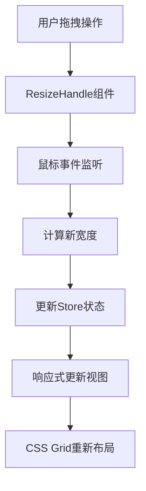

# DailyUse Editor 模块文档

## 概述

Editor 模块是 DailyUse 应用的核心模块之一，提供了类似 VS Code 的完整编辑器体验。它采用模块化架构，支持多文件编辑、文件浏览、版本控制等功能。

## 架构概览

Editor 模块采用经典的三层架构：

- **展示层 (Presentation Layer)**: Vue 组件
- **状态管理层 (State Management Layer)**: Pinia 状态存储
- **数据层 (Data Layer)**: 文件系统接口

### 目录结构

```
src/modules/Editor/
├── Editor.vue                 # 主编辑器容器组件
├── components/                # 子组件
│   ├── ActivityBar.vue        # 活动栏
│   ├── Sidebar.vue           # 侧边栏容器
│   ├── Explorer.vue          # 文件浏览器
│   ├── EditorGroup.vue       # 编辑器组
│   ├── EditorTabs.vue        # 编辑器标签页
│   ├── EditorArea.vue        # 编辑器核心区域
│   ├── SourceControl.vue     # 版本控制面板
│   ├── GitGraph.vue          # Git 历史图表
│   ├── StatusBar.vue         # 状态栏
│   ├── ResizeHandle.vue      # 大小调整手柄
│   └── ResizeHandleSiderbar.vue # 侧边栏调整手柄
└── stores/                    # 状态管理
    ├── activityBarStore.ts    # 活动栏状态
    ├── editorGroupStore.ts    # 编辑器组状态
    ├── editorLayoutStore.ts   # 布局状态
    ├── editorFunctionIconStore.ts # 编辑器功能按钮
    ├── fileStore.ts           # 文件状态
    └── sourceControlStore.ts  # 版本控制状态
```

## 核心组件详解

### 1. Editor.vue - 主容器组件

**功能**: 整个编辑器界面的根容器，负责布局管理和组件协调。

**特性**:

- 采用 CSS Grid 布局系统
- 响应式设计，支持侧边栏显示/隐藏
- 窗口大小变化时自动调整布局

**布局结构**:

```css
grid-template-columns: 45px var(--sidebar-width) 5px 1fr;
grid-template-rows: 1fr 30px;
```

**关键功能**:

- 监听窗口大小变化并重新分配编辑器宽度
- 管理编辑器组的动态布局
- 处理侧边栏显示/隐藏状态

### 2. ActivityBar.vue - 活动栏

**功能**: 提供快速访问不同功能面板的导航栏。

**特性**:

- 固定宽度 45px
- 支持图标高亮显示当前活动项
- 点击切换功能面板

**支持的功能面板**:

- **Explorer** (`mdi-file-multiple`): 文件资源管理器
- **Source Control** (`mdi-source-branch`): Git 版本控制

### 3. Explorer.vue - 文件浏览器

**功能**: 提供文件和文件夹的浏览、管理功能。

**核心特性**:

- **文件树展示**: 支持嵌套目录结构
- **文件操作**: 创建、删除、重命名、复制
- **右键菜单**: 上下文操作菜单
- **实时刷新**: 监听文件系统变化

**主要方法**:

```typescript
// 文件树操作
toggleNode(item: TreeNode)          // 展开/折叠目录
handleContextMenu(event, item)      // 右键菜单

// 文件操作
createFileForRepo()                 // 创建文件
createFolderForRepo()              // 创建文件夹
deleteFileOrFolder()               // 删除文件/文件夹
renameFileOrFolder()               // 重命名

// 编辑相关
startEdit(key, initialValue)       // 开始编辑
handleEditComplete()               // 完成编辑
cancelEdit()                       // 取消编辑
```

**文件类型图标映射**:

- HTML: `mdi-language-html5`
- JavaScript: `mdi-nodejs`
- JSON: `mdi-code-json`
- Markdown: `mdi-language-markdown`
- PDF: `mdi-file-pdf-box`
- 图片: `mdi-file-image`

### 4. EditorGroup.vue - 编辑器组

**功能**: 管理单个编辑器组，支持多文件标签页。

**布局结构**:

```css
grid-template-columns: 1fr;
grid-template-rows: 30px 1fr; /* 标签栏 + 编辑区域 */
```

**特性**:

- 动态宽度调整
- 活动状态管理
- 标签页切换

### 5. EditorTabs.vue - 标签页管理

**功能**: 管理编辑器标签页的显示和交互。

**特性**:

- 标签页切换
- 关闭按钮
- 溢出滚动
- 功能按钮集成

**编辑器功能按钮**:

- 预览模式切换
- 编辑器分割
- 关闭所有编辑器
- 更多操作菜单

### 6. EditorArea.vue - 编辑器核心

**功能**: 基于 Monaco Editor 的代码编辑器，支持 Markdown 预览。

**核心特性**:

#### 编辑器配置

- **主题**: 支持明暗主题切换
- **语言**: 主要支持 Markdown
- **功能**: 代码高亮、自动完成、语法检查
- **快捷键**: Ctrl+S / Cmd+S 保存

#### Markdown 支持

- **实时预览**: markdown-it 渲染
- **GitHub 样式**: 使用 github-markdown-css
- **图片粘贴**: 支持剪贴板图片转 Base64
- **链接处理**: 支持外部链接打开

#### 自动保存

```typescript
const autoSaveEnabled = computed(() => settingStore.editor.autoSave);
const autoSaveDelay = ref(1000); // 1 秒延迟
```

#### 图片处理

- 支持粘贴图片自动转换为 Base64
- Markdown 图片语法自动插入
- 图片数据折叠显示优化

### 7. SourceControl.vue - 版本控制

**功能**: 提供完整的 Git 版本控制界面。

**主要功能区域**:

#### 提交区域

- 提交消息输入框
- Ctrl+Enter 快捷提交
- 提交按钮状态管理

#### 变更管理

- **Staged Changes**: 已暂存的变更
- **Changes**: 工作区变更
- **文件状态**: 修改(M)、删除(D)、未跟踪(U)

#### 操作功能

```typescript
// Git 操作
stageFile(file); // 暂存文件
unstageFile(file); // 取消暂存
stageAllChanges(); // 暂存所有变更
unstageAllChanges(); // 取消暂存所有变更
commit(message); // 提交变更
discardAllChanges(); // 丢弃所有变更
```

#### Git 时间线

- 集成 GitGraph 组件
- 可折叠的历史记录视图
- 分支可视化

### 8. GitGraph.vue - Git 历史图表

**功能**: 可视化显示 Git 提交历史。

**特性**:

- 提交历史时间线
- 分支关系图
- 提交详细信息显示

## 状态管理详解

### 1. activityBarStore.ts - 活动栏状态

**状态结构**:

```typescript
interface ActivityBarItem {
  uuid: string;
  label: string;
  title: string;
  icon: string;
  component: Component;
}
```

**核心功能**:

- 管理活动栏项目
- 控制当前活动面板
- 侧边栏显示/隐藏状态

### 2. editorGroupStore.ts - 编辑器组状态

**状态结构**:

```typescript
interface EditorTab {
  uuid: string;
  path: string;
  title: string;
  isPreview?: boolean;
  isDirty?: boolean;
}

interface EditorGroup {
  uuid: string;
  active: boolean;
  width: number;
  tabs: EditorTab[];
  activeTabId: string | null;
}
```

**核心方法**:

```typescript
// 文件操作
openFile(path: string)              // 打开文件
closeTab(groupId: string, tabId: string) // 关闭标签页

// 编辑器组管理
addEditorGroup()                    // 添加编辑器组
removeEditorGroup(groupId: string) // 删除编辑器组
setActiveGroup(groupId: string)     // 设置活动组

// 标签页管理
setActiveTab(groupId: string, tabId: string) // 设置活动标签页
```

### 3. editorLayoutStore.ts - 布局状态

**状态结构**:

```typescript
interface EditorLayoutState {
  activityBarWidth: number; // 45px 固定
  sidebarWidth: number; // 160px 可调整
  minSidebarWidth: number; // 最小宽度
  resizeHandleSiderbarWidth: number; // 5px 调整手柄
  minEditorWidth: number; // 300px 最小编辑器宽度
  editorTabWidth: number; // 150px 标签宽度
  windowWidth: number; // 窗口宽度
}
```

**核心计算属性**:

```typescript
// 有效侧边栏宽度（考虑显示/隐藏状态）
effectiveSidebarWidth: (state) => {
  return activityBarStore.isSidebarVisible ? state.sidebarWidth : 0;
};

// 编辑器组可用宽度
editorGroupsWidth: (state) => {
  const availableWidth =
    state.windowWidth - state.activityBarWidth - state.resizeHandleSiderbarWidth;
  const sidebarWidth = activityBarStore.isSidebarVisible ? state.sidebarWidth : 0;
  return availableWidth - sidebarWidth;
};
```

### 4. sourceControlStore.ts - 版本控制状态

**状态结构**:

```typescript
interface SourceControlState {
  isGitRepo: boolean;
  currentBranch: string;
  changes: {
    staged: string[];
    modified: string[];
    deleted: string[];
    not_added: string[];
  };
  commits: GitCommit[];
}
```

## 响应式布局系统

### CSS Grid 布局

主编辑器使用 CSS Grid 实现响应式布局：

```css
.editor-layout {
  display: grid;
  grid-template-columns: 45px var(--sidebar-width) 5px 1fr;
  grid-template-rows: 1fr 30px;
}
```

### 动态宽度分配

编辑器组宽度动态分配算法：

```typescript
distributeEditorGroupWidths(newTotalWidth: number) {
    const groups = editorGroupStore.editorGroups
    const currentTotal = groups.reduce((sum, group) => sum + group.width, 0)

    // 按比例分配新宽度
    groups.forEach(group => {
        const proportion = group.width / currentTotal
        const newWidth = Math.floor(newTotalWidth * proportion)
        group.width = Math.max(newWidth, this.minEditorWidth)
    })

    // 处理舍入误差
    const actualTotal = groups.reduce((sum, group) => sum + group.width, 0)
    const remainder = newTotalWidth - actualTotal
    if (remainder !== 0 && groups.length > 0) {
        groups[groups.length - 1].width += remainder
    }
}
```

### 调整手柄系统

提供两种调整手柄：

1. **ResizeHandleSiderbar.vue**: 侧边栏宽度调整
2. **ResizeHandle.vue**: 编辑器组间宽度调整

## 多编辑器窗口大小调整机制详解

### 整体架构设计

DailyUse Editor 的多窗口大小调整系统采用了基于 **CSS Grid** 和 **事件驱动** 的响应式架构：



### 1. 布局基础 - CSS Grid 系统

整个编辑器使用 CSS Grid 作为布局基础：

```css
.editor-layout {
  display: grid;
  grid-template-columns: 45px var(--sidebar-width) 5px 1fr;
  grid-template-rows: 1fr 30px;
}

.editor-groups {
  grid-column: 4;
  grid-row: 1;
  display: flex; /* 编辑器组使用 Flex 布局 */
  overflow: hidden;
}
```

**关键设计原则**：

- **活动栏**：固定 45px 宽度
- **侧边栏**：动态宽度，通过 CSS 变量 `--sidebar-width` 控制
- **调整手柄**：固定 5px 宽度
- **编辑器区域**：占据剩余空间（`1fr`），内部使用 Flex 布局分配多个编辑器组

### 2. 双重调整机制

#### A. 侧边栏宽度调整 (ResizeHandleSiderbar.vue)

**触发机制**：

```typescript
const startResize = (_e: MouseEvent) => {
  isResizing.value = true;
  document.body.style.cursor = 'col-resize';
  document.addEventListener('mousemove', handleMouseMove);
  document.addEventListener('mouseup', stopResize);
};
```

**核心算法**：

```typescript
const handleMouseMove = (e: MouseEvent) => {
  if (!isResizing.value) return;
  const minWidth = store.minSidebarWidth;
  // 计算新宽度 = 鼠标X坐标 - 活动栏宽度(45px)
  const newWidth = Math.max(minWidth, e.clientX - 45);

  // 同时更新状态和CSS变量
  store.setSidebarWidth(newWidth);
  document.documentElement.style.setProperty('--sidebar-width', `${newWidth}px`);
};
```

**影响范围**：

- 直接影响侧边栏宽度
- 间接影响编辑器组总可用宽度
- 触发编辑器组宽度重新分配

#### B. 编辑器组间宽度调整 (ResizeHandle.vue)

**工作原理**：在相邻的两个编辑器组之间放置调整手柄

**核心实现**：

```typescript
const startResize = (e: MouseEvent) => {
  // 获取当前组和下一个组
  const currentIndex = editorGroupStore.editorGroups.findIndex((g) => g.uuid === props.groupId);
  const nextGroup = editorGroupStore.editorGroups[currentIndex + 1];

  // 记录初始状态
  startX.value = e.clientX;
  initialLeftWidth.value = editorGroupStore.getGroupWidth(props.groupId);
  initialRightWidth.value = editorGroupStore.getGroupWidth(nextGroup.uuid);
};

const handleMouseMove = (e: MouseEvent) => {
  const deltaX = e.clientX - startX.value;
  const minWidth = 200; // 最小编辑器宽度

  // 计算新宽度，确保总宽度不变
  const newLeftWidth = Math.max(minWidth, initialLeftWidth.value + deltaX);
  const newRightWidth = Math.max(minWidth, initialRightWidth.value - deltaX);

  // 零和游戏：左侧增加的宽度 = 右侧减少的宽度
  if (newLeftWidth + newRightWidth === initialLeftWidth.value + initialRightWidth.value) {
    editorGroupStore.setGroupWidth(props.groupId, newLeftWidth);
    editorGroupStore.setGroupWidth(nextGroup.uuid, newRightWidth);
  }
};
```

**核心特性**：

- **零和调整**：总宽度保持不变，一个增加另一个必须减少
- **最小宽度保护**：每个编辑器组最小宽度 200px
- **实时更新**：拖拽过程中实时更新视图

### 3. 状态管理层 - 宽度分配算法

#### editorLayoutStore 中的计算逻辑

```typescript
// 计算编辑器组可用总宽度
editorGroupsWidth: (state) => {
  const availableWidth =
    state.windowWidth - state.activityBarWidth - state.resizeHandleSiderbarWidth;
  const sidebarWidth = activityBarStore.isSidebarVisible ? state.sidebarWidth : 0;
  return availableWidth - sidebarWidth;
};
```

#### editorGroupStore 中的分配算法

**1. 比例分配算法** - `distributeEditorGroupWidths()`:

```typescript
distributeEditorGroupWidths(newTotalWidth: number) {
    const groups = editorGroupStore.editorGroups
    const currentTotal = groups.reduce((sum, group) => sum + group.width, 0)

    // 按当前比例重新分配
    groups.forEach(group => {
        const proportion = group.width / currentTotal
        const newWidth = Math.floor(newTotalWidth * proportion)
        group.width = Math.max(newWidth, this.minEditorWidth)
    })

    // 处理舍入误差 - 余数分配给最后一个编辑器
    const actualTotal = groups.reduce((sum, group) => sum + group.width, 0)
    const remainder = newTotalWidth - actualTotal
    if (remainder !== 0 && groups.length > 0) {
        groups[groups.length - 1].width += remainder
    }
}
```

**2. 空间回收算法** - `removeEditorGroup()`:

```typescript
removeEditorGroup(groupId: string) {
    const index = this.editorGroups.findIndex(g => g.uuid === groupId)
    const removedGroupWidth = this.editorGroups[index].width

    this.editorGroups.splice(index, 1)

    // 优先分配给左侧编辑器，如果没有则分配给右侧
    if (this.editorGroups.length > 0) {
        const targetGroup = this.editorGroups[index - 1] || this.editorGroups[index]
        if (targetGroup) {
            targetGroup.width += removedGroupWidth
        }
    }
}
```

### 4. 响应式系统 - 监听与更新

#### 窗口大小变化响应

```typescript
// Editor.vue 中的监听逻辑
const updateWindowWidth = () => {
  editorLayoutStore.updateWindowWidth(window.innerWidth);
};

watch(
  () => editorLayoutStore.editorGroupsWidth,
  (newWidth) => {
    editorLayoutStore.distributeEditorGroupWidths(newWidth);
  },
  { immediate: true },
);

onMounted(() => {
  window.addEventListener('resize', updateWindowWidth);
  editorLayoutStore.distributeEditorGroupWidths(window.innerWidth);
});
```

#### CSS 变量响应式绑定

```typescript
// 侧边栏宽度变化
watch(
  () => editorLayoutStore.sidebarWidth,
  (newWidth) => {
    document.documentElement.style.setProperty('--sidebar-width', `${newWidth}px`);
  },
);

// 编辑器标签宽度变化
watch(
  () => editorLayoutStore.editorTabWidth,
  (newWidth) => {
    document.documentElement.style.setProperty('--editor-tab-width', `${newWidth}px`);
  },
  { immediate: true },
);
```

### 5. 视觉反馈系统

#### 拖拽状态视觉提示

```css
.resize-handle {
    width: 5px;
    cursor: col-resize;
    transition: background-color 0.1s;
}

.resize-handle:hover,
.resize-handle.resizing {
    background-color: var(--vscode-scrollbarSlider-hoverBackground);
}

/* 拖拽时改变全局光标 */
document.body.style.cursor = 'col-resize'  // JavaScript 中设置
```

#### 边界视觉指示器

```css
.resize-handle::after {
  content: '';
  position: absolute;
  left: 2px;
  top: 0;
  bottom: 0;
  width: 1px;
  background-color: var(--vscode-editorGroup-border, #444);
}
```

### 6. 性能优化策略

#### 1. 事件处理优化

- 使用 `mousedown` 开启拖拽，避免过多的 `mousemove` 监听
- 在 `mouseup` 时清理事件监听器，防止内存泄漏

#### 2. 计算优化

- 使用 `computed` 属性缓存复杂计算
- 避免在拖拽过程中进行 DOM 查询

#### 3. 批量更新

- 将多个宽度更新操作合并
- 使用 `nextTick` 确保 DOM 更新时机

### 7. 边界情况处理

#### 最小宽度保护

```typescript
const minWidth = 200;
const newLeftWidth = Math.max(minWidth, initialLeftWidth.value + deltaX);
const newRightWidth = Math.max(minWidth, initialRightWidth.value - deltaX);
```

#### 窗口边界检测

```typescript
// 确保侧边栏不超出窗口
const newWidth = Math.max(minWidth, Math.min(maxWidth, e.clientX - 45));
```

#### 舍入误差处理

```typescript
// 将舍入产生的余数分配给最后一个编辑器
const remainder = newTotalWidth - actualTotal;
if (remainder !== 0) {
  groups[groups.length - 1].width += remainder;
}
```

### 8. 调试和监控

#### 开发模式日志

```typescript
console.log('startResize', initialLeftWidth.value, initialRightWidth.value);
console.log('distributeWidths', { totalWidth, groupCount, widthPerGroup });
```

#### 状态持久化

```typescript
// 所有布局状态都通过 Pinia persist 插件持久化
persist: true;
```

### 总结

DailyUse Editor 的多窗口大小调整系统是一个精心设计的响应式布局解决方案：

**核心优势**：

1. **双层调整机制**：同时支持侧边栏和编辑器组间的独立调整
2. **零和游戏设计**：确保总宽度恒定，避免布局破坏
3. **比例保持算法**：窗口大小变化时保持编辑器间的相对比例
4. **边界保护机制**：防止编辑器过小影响使用体验
5. **实时响应性**：拖拽过程中的流畅视觉反馈

**技术特点**：

- 基于现代 CSS Grid 和 Flexbox 的混合布局
- 事件驱动的状态管理模式
- 响应式的 CSS 变量系统
- 完善的边界条件处理

## 主题系统集成

### 主题切换支持

```typescript
const themeStore = useThemeStore();
const editorTheme = computed(() => `vs-${themeStore.currentThemeStyle}`);
```

### CSS 变量使用

```css
:root {
  --sidebar-width: 160px;
  --editor-tab-width: 150px;
}
```

## 文件系统集成

### 文件操作接口

```typescript
// 文件读写
fileSystem.readFile(path: string)
fileSystem.writeFile(path: string, content: string)

// 文件管理
fileSystem.delete(path: string, isFolder: boolean)
fileSystem.rename(oldPath: string, newPath: string)
fileSystem.refreshFolder(path: string)
```

### 自动保存机制

```typescript
watch(content, () => {
  if (autoSaveEnabled.value) {
    if (autoSaveTimer) clearTimeout(autoSaveTimer);

    autoSaveTimer = setTimeout(async () => {
      if (content.value !== originalContent) {
        await saveContent();
        originalContent = content.value;
      }
    }, autoSaveDelay.value);
  }
});
```

## 性能优化

### 1. 虚拟滚动

- 大文件列表使用虚拟滚动优化渲染性能

### 2. 懒加载

- 编辑器组件按需加载
- Monaco Editor 异步初始化

### 3. 防抖处理

- 自动保存使用防抖机制
- 文件系统刷新防抖

### 4. 内存管理

- 及时清理事件监听器
- 组件卸载时清理定时器

## 快捷键支持

### 全局快捷键

- `Ctrl+S` / `Cmd+S`: 保存当前文件
- `Ctrl+Enter`: Git 提交（在提交消息框中）

### 编辑器快捷键

- 继承 Monaco Editor 的所有内置快捷键
- 支持多光标编辑
- 智能代码提示

## 扩展性设计

### 1. 插件化架构

- ActivityBar 支持动态注册新面板
- 编辑器功能按钮可扩展

### 2. 主题扩展

- 支持自定义主题
- CSS 变量系统便于样式定制

### 3. 语言支持扩展

- Monaco Editor 支持多种编程语言
- 可配置语言特定功能

## 使用示例

### 基本使用

```vue
<template>
  <Editor />
</template>

<script setup>
import Editor from '@/modules/Editor/Editor.vue';
</script>
```

### 状态管理使用

```typescript
import { useEditorGroupStore } from '@/modules/Editor/stores/editorGroupStore';

const editorStore = useEditorGroupStore();

// 打开文件
editorStore.openFile('/path/to/file.md');

// 创建新编辑器组
editorStore.addEditorGroup();
```

## 最佳实践

### 1. 组件设计

- 单一职责原则：每个组件专注于特定功能
- 组件间通过 props 和 events 通信
- 复杂状态通过 Pinia 管理

### 2. 性能优化

- 使用 `computed` 进行响应式计算
- 合理使用 `watch` 监听变化
- 及时清理副作用

### 3. 错误处理

- 文件操作异常捕获
- 用户友好的错误提示
- 优雅降级处理

### 4. 代码组织

- 按功能模块组织代码
- 统一的命名约定
- 完善的类型定义

## 总结

DailyUse Editor 模块是一个功能完整、架构清晰的代码编辑器实现。它成功地将 VS Code 的核心功能移植到了 Web 环境，提供了流畅的编辑体验。模块化的设计使其具有良好的可维护性和扩展性，是现代桌面应用开发的优秀实践。

### 技术栈总结

- **前端框架**: Vue 3 + TypeScript
- **状态管理**: Pinia
- **编辑器内核**: Monaco Editor
- **样式系统**: CSS Grid + Scoped CSS
- **构建工具**: Vite
- **版本控制**: Git 集成

该模块展现了现代前端开发的最佳实践，包括组件化架构、响应式设计、状态管理、性能优化等多个方面。
